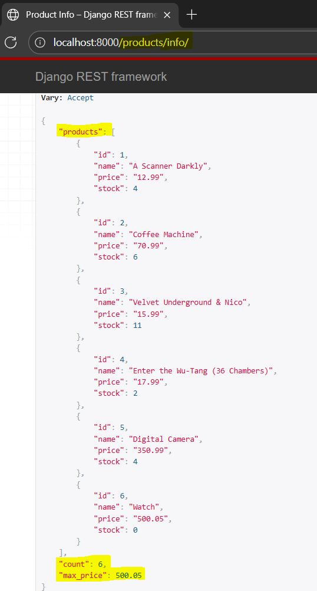

###  Serializer subclass and aggregated API data

Writing generic serializer that are not tied to specific models in application, but reprsent any kind of data that is actually returned in an API response

Step 1: Create ProductInfoSerializer() in `api/serializers.py` that will get details of all products, count of products and max price 
```
class ProductInfoSerializer(serializers.Serializer):
    products = ProductSerializer(many=True)
    count = serializers.IntegerField()
    max_price = serializers.FloatField()
```

step 2: Define view product_info, in `api/views.py`, with GET API property having fetch all products. 
add serializer info with parameters of product info as 
```
@api_view(['GET'])
def product_info(request):
    products = Product.objects.all()
    serializer = ProductInfoSerializer({
        'products': products,
        'count': len(products),
        'max_price': products.aggregate(max_price=Max('price'))['max_price']
    })
    return Response(serializer.data)
```

Here, max price is products aggregate price. 
apply the aggregate func method to products,
pass the parameter max_price as Max('price'), built-in Django function, price as seen in product model in models.py
when aggregation is performed, need to get aggregated data out of resulting dictionary, that can be done by indexing the key name agrument that represents the aggregation ['max_price']


Step 3: Add url path for product_info view 
```
path('products/info/', views.product_info),
```

Run the browser to view product/info/



