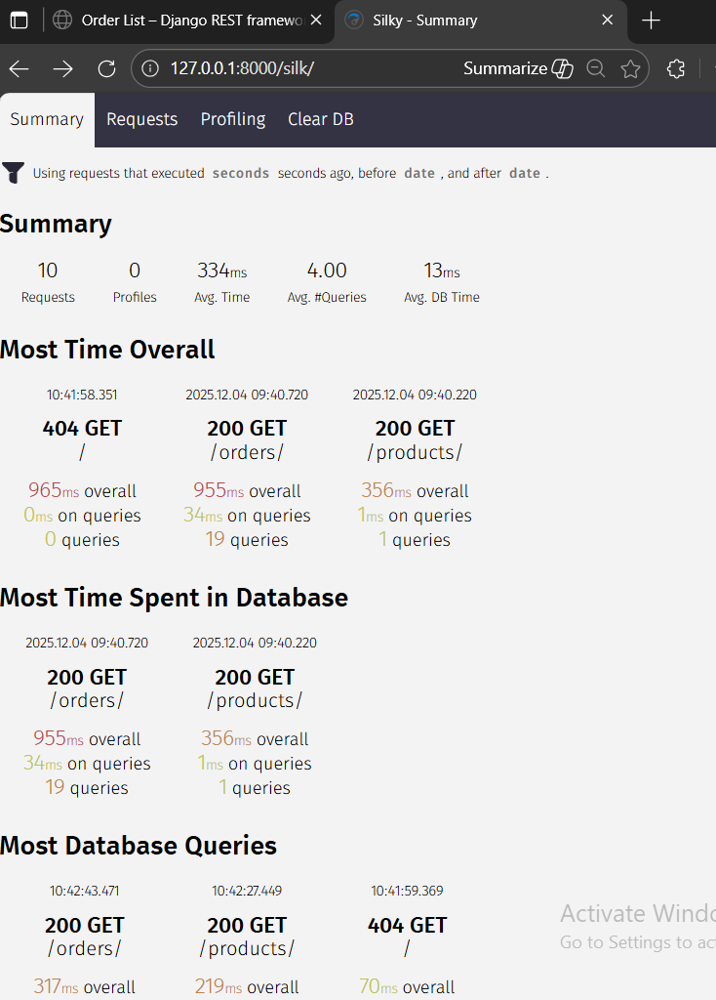
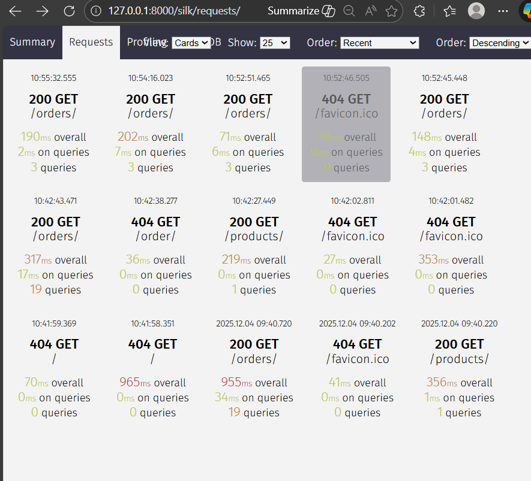
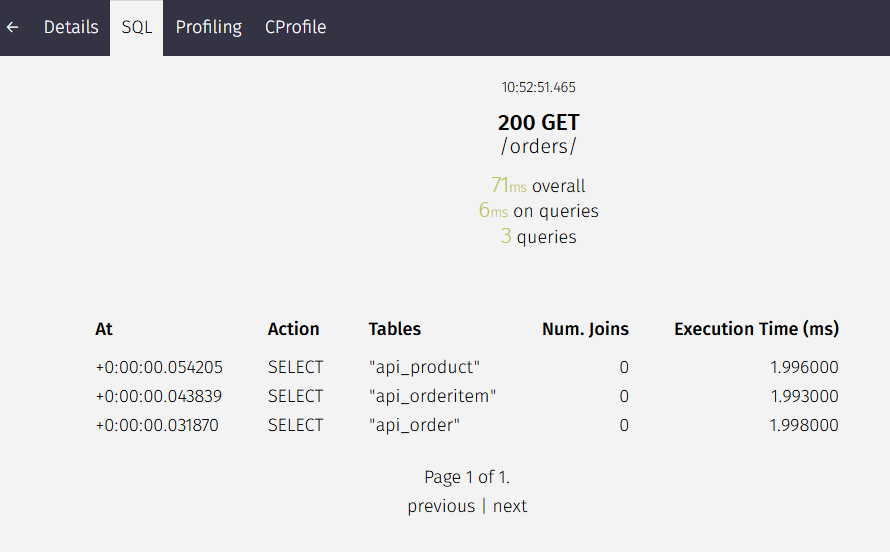
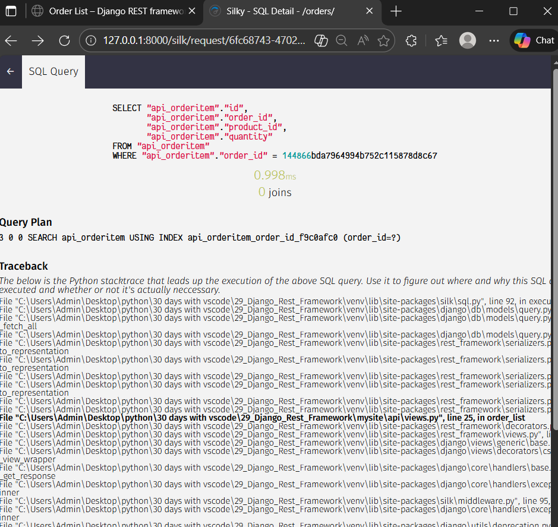

#### Profiling and Optimization Using django-silk

About [django-silk](https://github.com/jazzband/django-silk)
- used for profiling

Setup django-silk as per doc

Step 1: Install django-silk
(venv) PS ..\29_Django_Rest_Framework\mysite> pip install django-silk

Step 2: In `mysite/settings.py` 
1) add 'silk' to INSTALLED_APPS
2) add 'silk.middleware.SilkyMiddleware' to MIDDLEWARE

Step 3: Add silk pathin project's url, `mysite/urls.py`
```
path('silk/', include('silk.urls', namespace='silk')),
```

Step 4: Run migrate cmd in terminal
```
(venv) PS ..\29_Django_Rest_Framework\mysite> python .\manage.py migrate
Operations to perform:
  Apply all migrations: admin, api, auth, contenttypes, sessions, silk
Running migrations:
  Applying silk.0001_initial... OK
  Applying silk.0002_auto_update_uuid4_id_field... OK
  Applying silk.0003_request_prof_file... OK
  Applying silk.0004_request_prof_file_storage... OK
  Applying silk.0005_increase_request_prof_file_length... OK
  Applying silk.0006_fix_request_prof_file_blank... OK
  Applying silk.0007_sqlquery_identifier... OK
  Applying silk.0008_sqlquery_analysis... OK
```

Step 5: run server on browser
> python .\manage.py runserver

*****************************************************
play around in browser to view api requests, befor e that make sure to visit the urls we created.

open url localhost:8000/product/ and localhost:8000/orders/ 

goto url localhost:8000/silk/ and view the api request of above 2 webpages, 


view the request tab, 


click on any api request, here orders/


click on sql tab to view the db query 


click on any select query to analyse the query 



Let's  add following to `api/views.py/class OrderItem`
orders = Order.objects.prefetch_related('items').all()
refresh the orders/ url and check the time required/latency to fetch the data using silk api

similary observe for 
orders = Order.objects.prefetch_related('items', 'items__product').all()
and
orders = Order.objects.prefetch_related('items__product')


