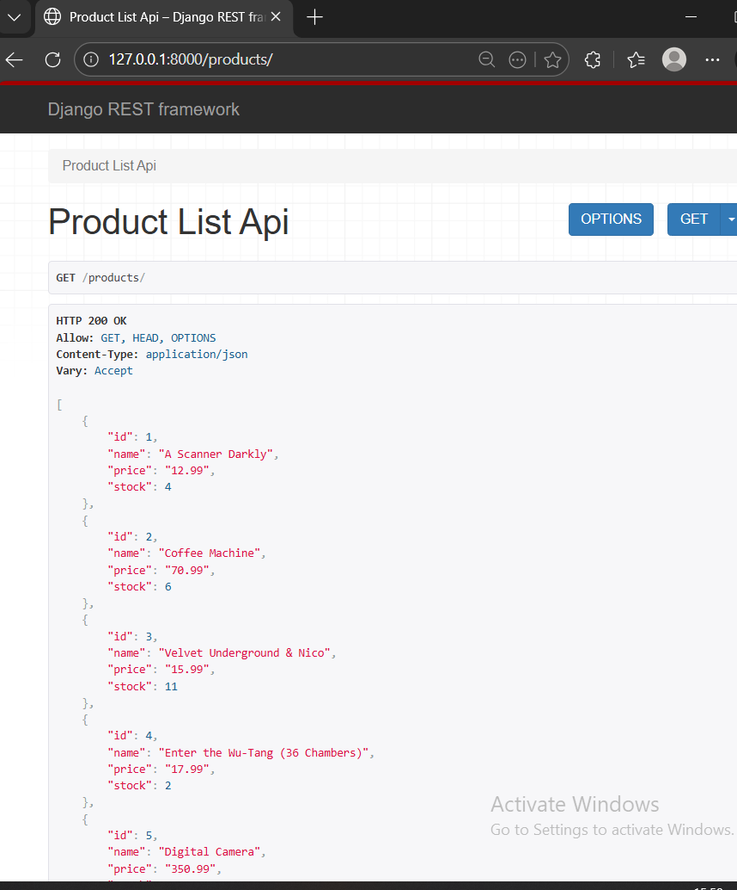
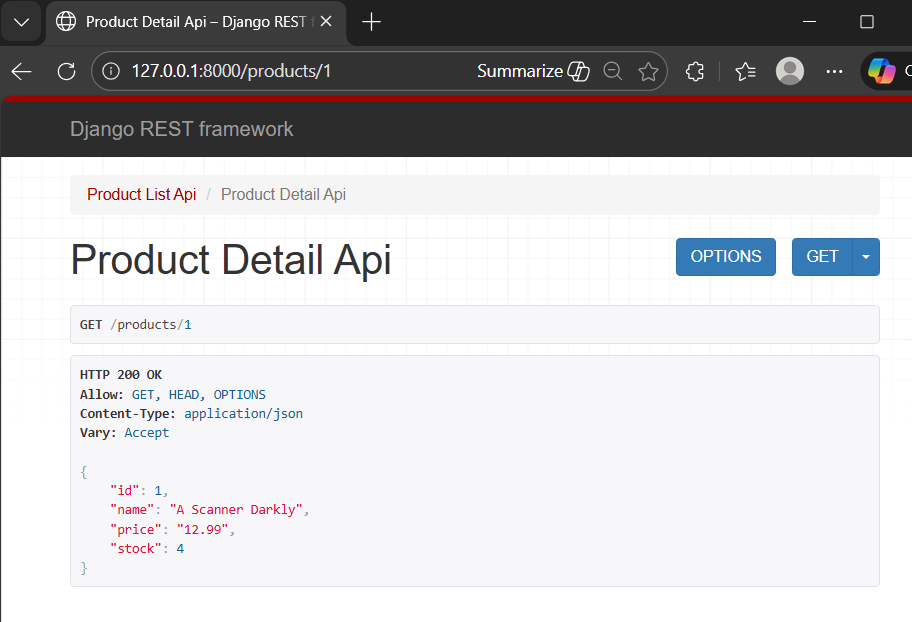
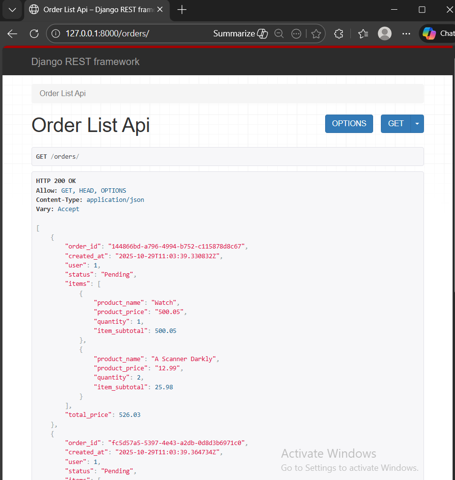
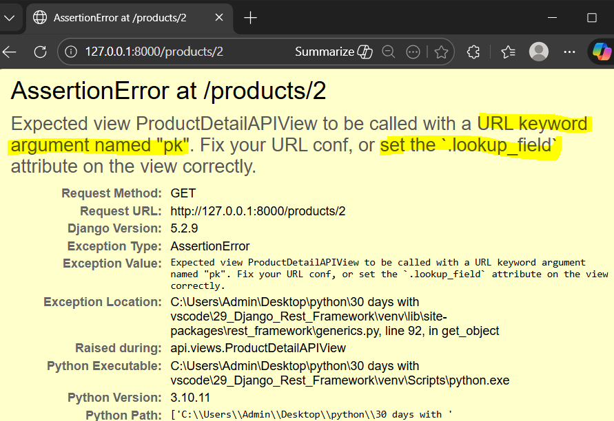
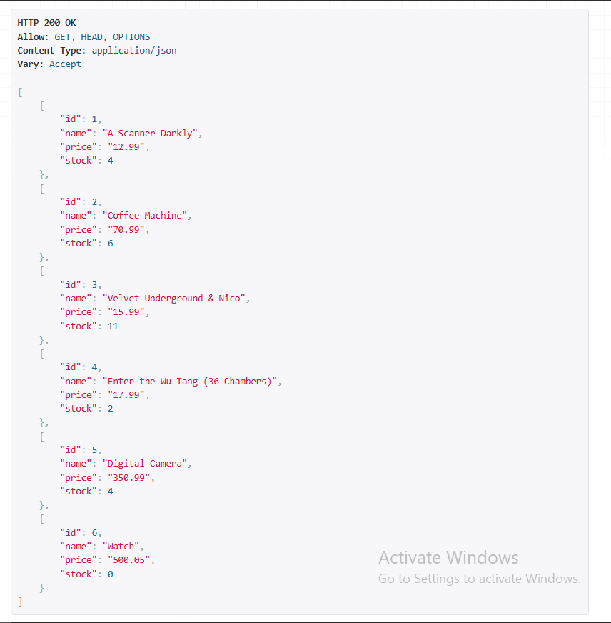
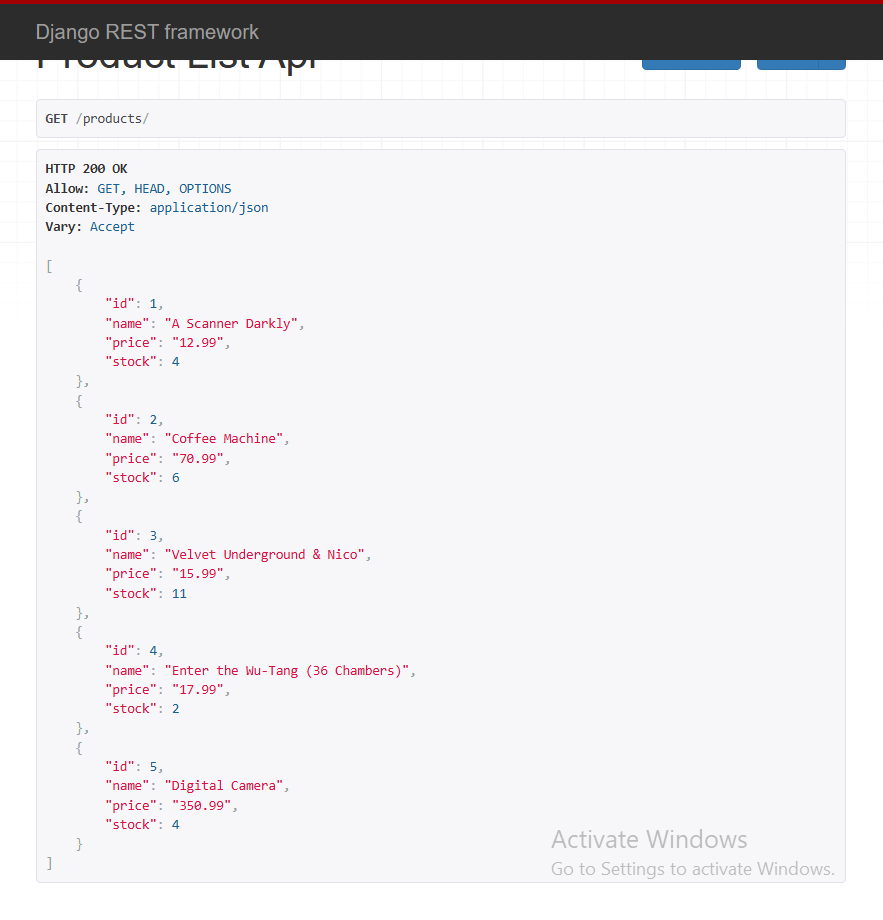
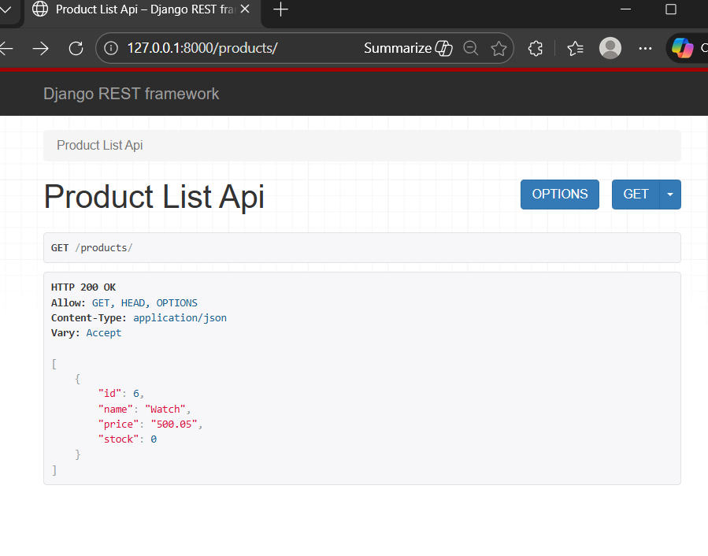

#### Generic Views
[Generic Views](https://www.django-rest-framework.org/api-guide/generic-views/) allow to build API views that map closely to our DB models.
All the generic views are read-only. 

- ListAPIView
Used for read-only endpoints to represent a collection of model instances.
Provides a get method handler.

- RetrieveAPI
Used for read-only endpoints to represent a single model instance (here, product_id or pk).
Provides a get method handler.

##### ListAPIView
Step 1: Create a class-based view (CBV) for product list calling pre-defined class generics.ListAPIView in `api/views.py` (replacing the function based view product_list)
```
class ProductListAPIView(generics.ListAPIView):
    queryset = Product.objects.all()
    serializer_class = ProductSerializer
```

Step 2: Change products url to
path('products/', views.ProductListAPIView.as_view()),


##### RetrieveAPI
Step 1: Create ProductDetailView CBV for product_detail replacing its FBV calling RetrieveAPIView class method but has same attributes as ProductListAPIView
```
class ProductDetailAPIView(generics.RetrieveAPIView):
    queryset = Product.objects.all()
    serializer_class = ProductSerializer
```

Step 2: Chnage the products detail url to new class view


Step 3: Similarly, create class OrderListAPIView replacing order_list() and change path in urls.py


How does ProductDetailAPIView knows to access each product_id without mapping primary keys or associating to ProductListAPIView ?
Look at [GenericAPIView attributes](https://www.django-rest-framework.org/api-guide/generic-views/#attributes)

lookup_field - The model field that should be used for performing object lookup of individual model instances. Defaults to 'pk'.
lookup_url_kwarg - The URL keyword argument that should be used for object lookup. The URL conf should include a keyword argument corresponding to this value. If unset this defaults to using the same value as lookup_field.

if we change the url pattern 
path('products/<int:pk>'..)
to path('products/<int:product_id>'..)
this throws an AssertionError 



Now lets set the attribute lookup_url_kwarg to 'product_id' in `views.py/class ProductDetailAPIView`

** This will show the Product detail api page as above

SO, we change url keyword arg lookup_url_kwarg to that in urls.py, i.e. product_id.
This tells the RetrieveAPI view which URL arg to use when looking up product by that value

************************ Miscellaneous ************************

in `views.py/class ProductListAPIView` apply query filter to show stocks greater than 0
```
queryset = Product.objects.filter(stock__gt=0)
```
Before:


After:


That's how easy it is to query API endpoints using generic class-based views.

Also, can use exclude() that will only return product out of stock.
```
queryset = Product.objects.exclude(stock__gt=0)
```

