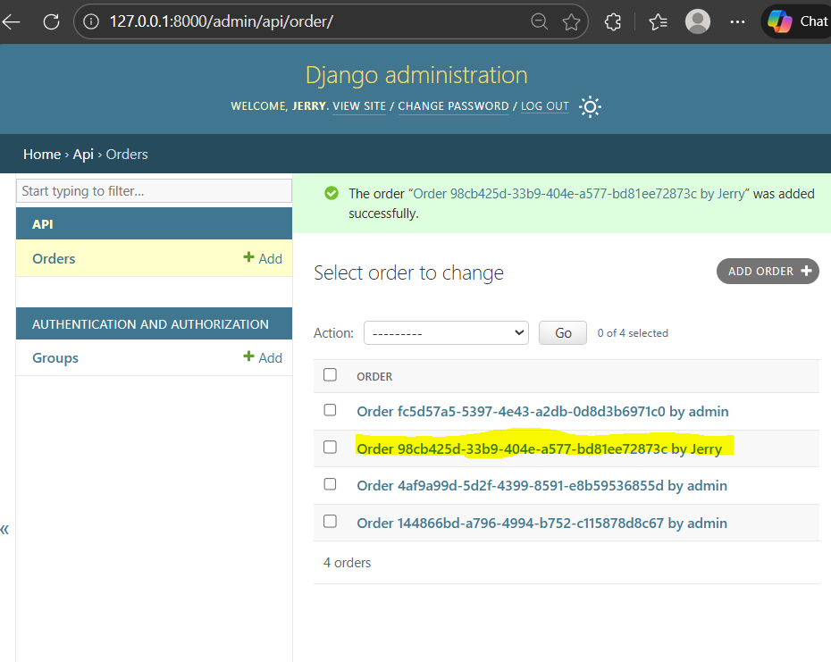
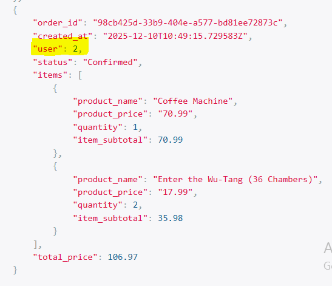
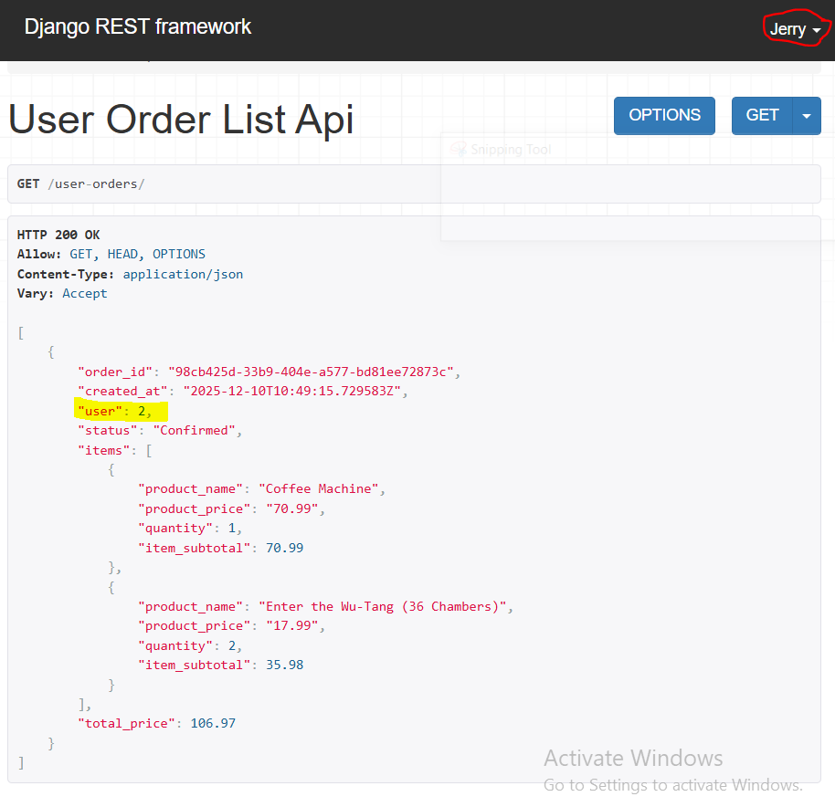

### Dynamic Filtering 
- using [get_query() method](https://www.django-rest-framework.org/api-guide/generic-views/#attributes)

Initially, we will register the OrderList model to Django admin

Step 1: Activate the admin by creating superuser, run cmd in terminal
>> python .\manage.py createsuperuser
enter user and password

Step 2: Created 2 class OrderItemInlines and inherit in OrderAdmin
Register Order models using class OrderAdmin in `api/admin.py` 
Make sure to add admin url in main project folder, here, `mysite/mysite/urls.py`
```
from django.contrib import admin
urlpatterns = [        
    path('admin/', admin.site.urls),
]
```

**********************************************
Runserver to verify admin page
Login to admin using superuser credentials 
click on Order, then click on "Add Order"
Fill in Order details using different user 


CLick on Save


Browse to Order/ and view the order with new user_id is added.


**********************************************

Overriding the [get_query() method](https://www.django-rest-framework.org/api-guide/generic-views/#methods)

Step 1: create new class UserOrderListAPIView and define get_queryset() method in class
add url 'user-order/' path to `api/urls.py`

Step 2: Goto url 'user-order/' from same web page tab and will see the filtered order only of the user as logged in (urser 2)


** Try login admin page as user 'admin' and password 'test' as mentioned in populate_db.py, and goto url 'user-order/'.
It will show orders of user 1 since its 'admin'


