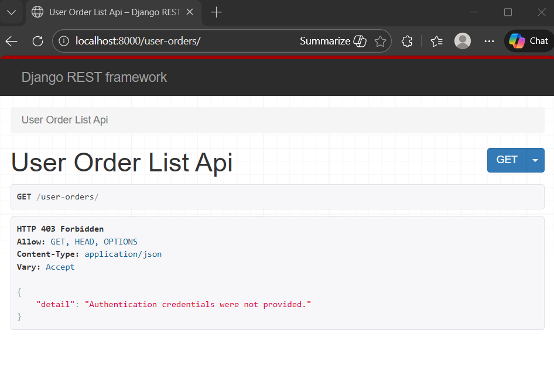

### Permissions and Testing Permissions
Doc on [Permissions](https://www.django-rest-framework.org/api-guide/permissions/)

In dynamic filtering, we were able to view the user-orders/ of user which logged in from admin page.
Same is not possible if we see user-orders/ from new tab of user logged in from admin.
It throws TypeError expecting an 'id' of the user.


Step 1: In `views.py` add the permission to class 
from rest_framework.permissions import IsAuthenticated
class UserOrderListAPIView(generics.ListAPIView):    
    ..
    permission_classes = [IsAuthenticated]

After adding above lines, run the server and check user-orders/ page.
Terminal output :
```
Forbidden: /user-orders/
[18/Dec/2025 15:59:43] "GET /user-orders/ HTTP/1.1" 403 4989
```


Step 2: name the url user-orders/ in `api/urls.py` to call in testcase
path('user-orders/', views.UserOrderListAPIView.as_view(), name='user-orders'),

Step 3: Added TestCase to verify the authetication works in `api/test.py`
- created orders for user1 and user2 
- testcase work when method start with "test_"
- if response status code is 200 then we simply print data 
```
assert response.status_code == 200
data = response.json()
print(data)
```

on terminal run to create order for user1 (try same for user2):
```
> python .\manage.py test   
Found 1 test(s).
Creating test database for alias 'default'...
System check identified no issues (0 silenced).
[{'order_id': '1fff241c-e8eb-46a2-b6bc-aca24577b9d9', 'created_at': '2025-12-18T11:18:59.502501Z', 'user': 1, 'status': 'Pending', 'items': [], 
'total_price': 0}, {'order_id': 'efaea642-a280-43c0-a7fc-5c2aa198c41a', 
'created_at': '2025-12-18T11:18:59.502501Z', 'user': 1, 'status': 'Pending', 'items': [], 'total_price': 0}]
.
----------------------------------------------------------------------  
Ran 1 test in 2.434s

OK
Destroying test database for alias 'default'...
```

Now, Lets add permission to print only authenticated user's orders
```
assert response.status_code == 200
orders = response.json()
self.assertTrue(all(order['user'] == user.id for order in orders))
```
It will check user key from order with user.id and display endpoints for only the logged in user's order


added testcase to verify failed authentication 
```
def test_user_order_list_unauthenticated(self):
        response = self.client.get(reverse('user-orders'))
        self.assertEqual(response.status_code, 403)
```

try assert equality with 401
```
>> python .\manage.py test   
Found 2 test(s).
Creating test database for alias 'default'...
System check identified no issues (0 silenced).
.F
======================================================================  
FAIL: test_user_order_list_unauthenticated (api.tests.UserOrderTestCase)----------------------------------------------------------------------  
  test_user_order_list_unauthenticated
    self.assertEqual(response.status_code, 401)
AssertionError: 403 != 401

----------------------------------------------------------------------  
Ran 2 tests in 4.242s

FAILED (failures=1)
Destroying test database for alias 'default'...
```

using the rest_framework.status for readability, code change to:
self.assertEqual(response.status_code, status.HTTP_403_FORBIDDEN)
```
>> python .\manage.py test   
Found 2 test(s).
Creating test database for alias 'default'...
System check identified no issues (0 silenced).
..
----------------------------------------------------------------------  
Ran 2 tests in 4.906s

OK
```


