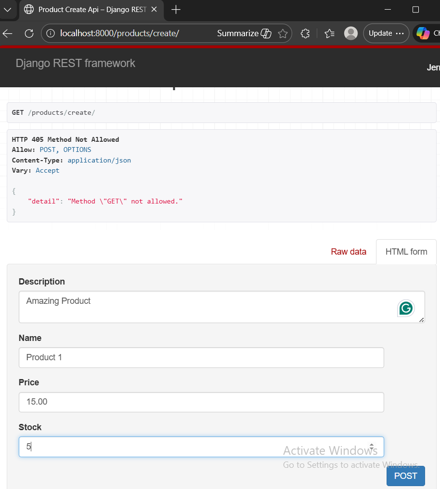
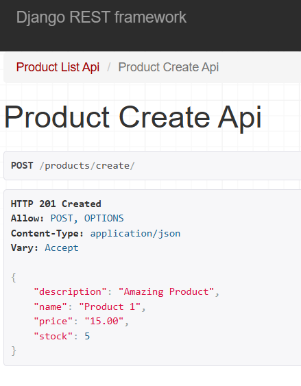
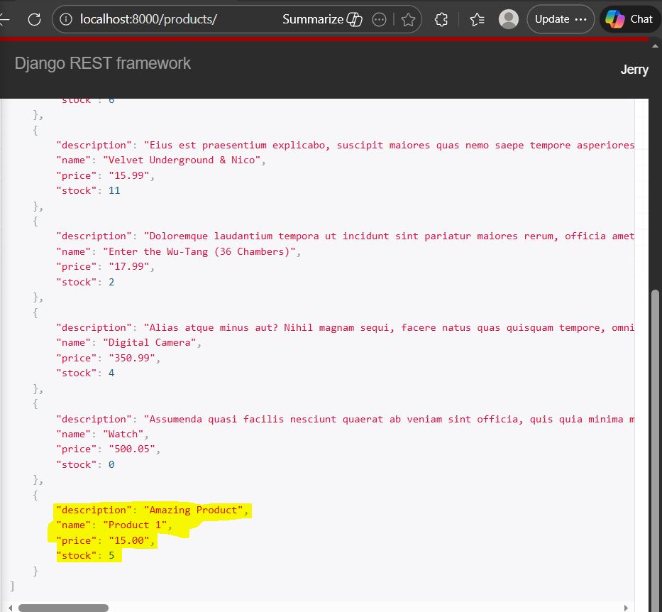
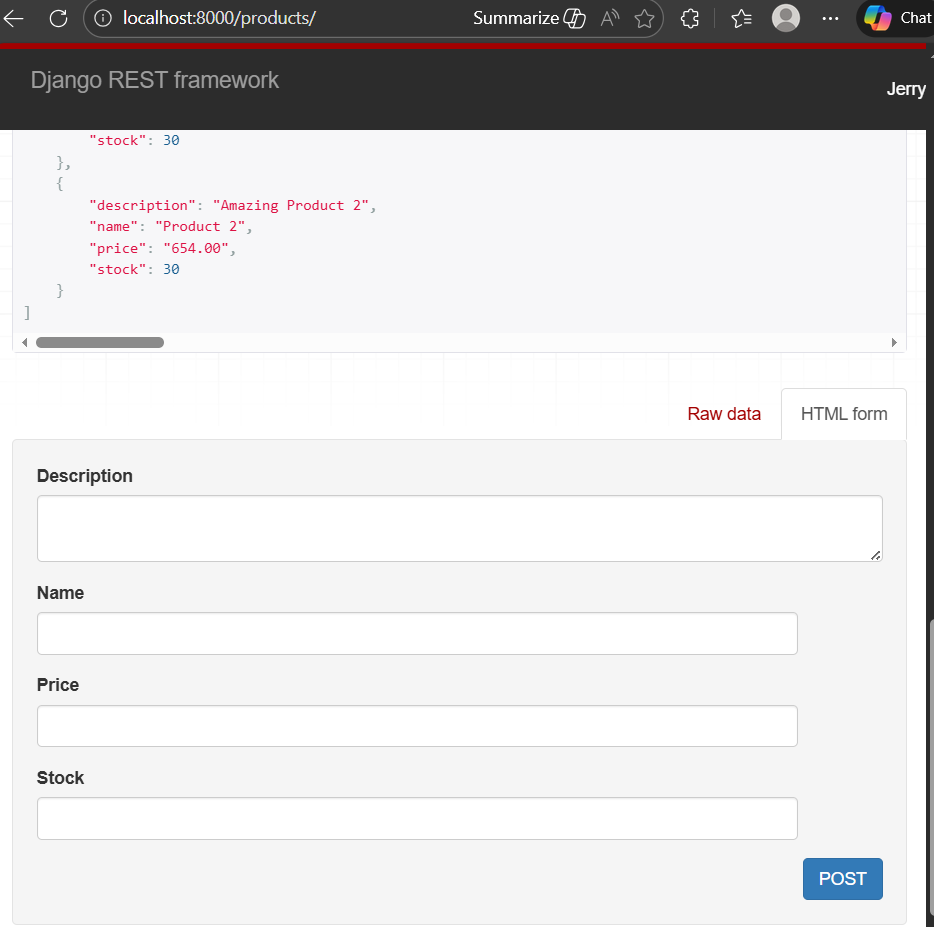
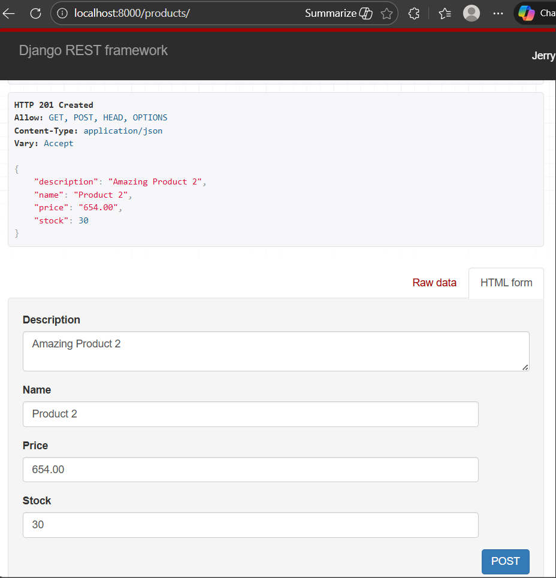

### Creating Data|ListCreateAPIView and Generic View Internals

Step 1: Create CBV ProductCreateAPIView using [generics.CreateAPIView](https://www.django-rest-framework.org/api-guide/generic-views/#createapiview) attr
```
class ProductCreateAPIView(generics.CreateAPIView):
    model = Product
    serializer_class = ProductSerializer
```

Step 2: create its url
``` path('products/create/', views.ProductCreateAPIView.as_view()), ```

** Run browser and view the webpage, "localhost/products/create/" , this endpoint has only POST request and not GET 
add the product details and click POST


Once posted, page shows HTTP response 201 created and details of the added product 


Refresh "localhost/products/" and verify new product is added.



Classy DRF(cdrf.co) : Shows detailed description of CBVs and serializers, with full methods and attributes

Look at create method in CreateAPIView

Step 3: Add create to class ProductCreateAPIView
```
def create(self, request, *args, **kwargs):
        print(request.data)
        return super().create(request, *args, **kwargs)
```
** runserver and new product and POST
in terminal, we see 
[23/Dec/2025 17:37:40] "GET /products/create/ HTTP/1.1" 405 8169
<QueryDict: {'csrfmiddlewaretoken': ['JHsVjLowdHiYmZrtBzID0a4LRZSJSymQVwilF5lh3aRnUZC5kEV6HBXuQ8bOYcmY'], 'description': ['Amazing Product !!'], 'name': ['Product 1'], 'price': ['15.00'], 'stock': ['5']}>

if change print(request.data) to
``` print(request.POST.get('name')) ```

** we get name in terminal
Product 1
[23/Dec/2025 17:44:45] "POST /products/create/ HTTP/1.1" 201 8291

create is POST method and a [CreateModelMixin](https://www.django-rest-framework.org/api-guide/generic-views/#createmodelmixin)
Similary, for ListAPIView has list GET method which is [ListModelMixin](https://www.django-rest-framework.org/api-guide/generic-views/#listmodelmixin)


Now, Instead of using 2 diff CBVs for same webpage, lets consolidate product/ for both GET and POST methods using [ListCreateAPIView](https://www.django-rest-framework.org/api-guide/generic-views/#listcreateapiview)

Step 4: Change ```class ProductListView(ListAPIView)``` to ```ProductListCreateAPIView(generics.ListCreateAPIView)```
remove class ProductCreateAPIView
Change url ```path('products/', views.ProductListCreateAPIView.as_view()),``` 
remove ```product/create/``` url

** run browser and view products/ , the POST form will be at bottom 


add new product and click POST, hhtp response created with details of new product


