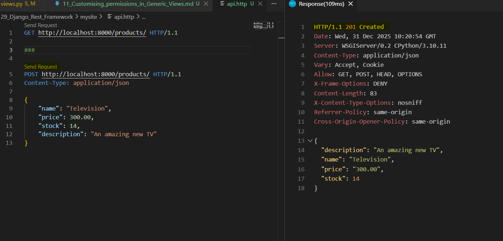
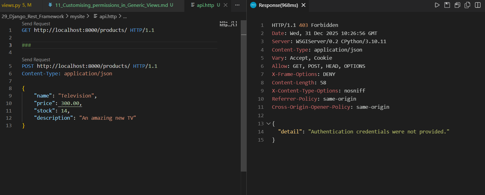

### Customising permissions in Generic Views | VSCode REST Client extension

Step 1: Install "Rest Client" from VS Code Extensions

Step 2: Create file "api.http" in mysite directory to write api request
Run server and click on "Send Request" button on file above GET request --> Opens Response tab


Step 3: Click on POST request to create new product TV


Step 4: Add Admin authentication for POST request in `api/views.py/class ProductListCreateAPIView`
```
from rest_framework.permissions import (IsAuthenticated,IsAdminUser, AllowAny)

# Add get_permission() method to class
def get_permissions(self):
        self.permission_classes = [AllowAny]
        if self.request.method == 'POST':
            self.permission_classes = [IsAdminUser]
        return super().get_permissions()
```

Step 5: Now, send request to create POST.


Its an Authentication Error as we set permission to POST only for Admin.

