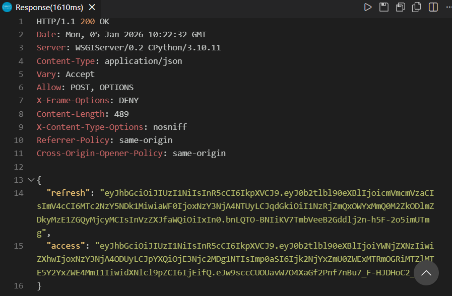
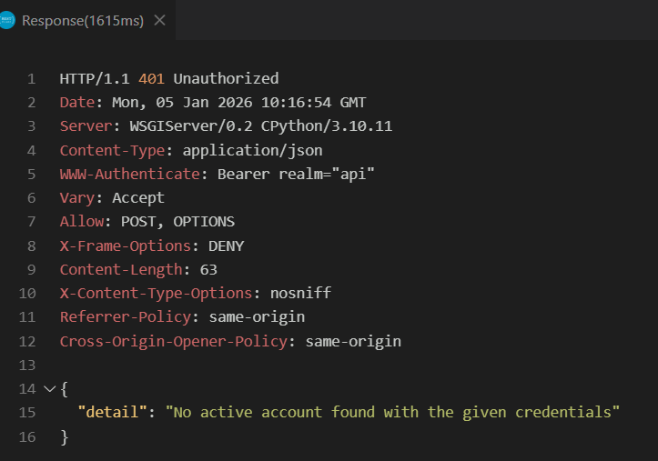
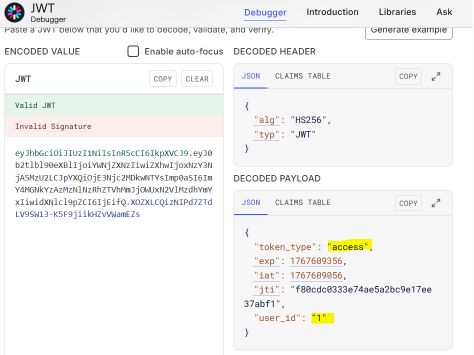
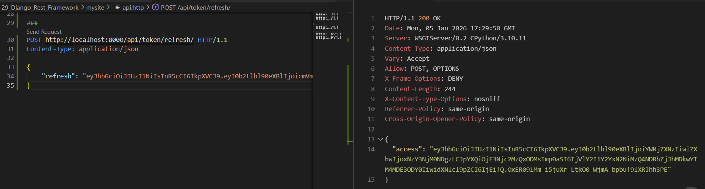

### JWT Authentication with simplejwt

JWT - JSON Web Token
Reference: [Authentication Guide](https://www.django-rest-framework.org/api-guide/authentication/#authentication)

Step 1: In settings.py, follow the [doc auth scheme](https://www.django-rest-framework.org/api-guide/authentication/#setting-the-authentication-scheme)
```
REST_FRAMEWORK = {
    'DEFAULT_AUTHENTICATION_CLASSES': [
        'rest_framework.authentication.BasicAuthentication',
        'rest_framework.authentication.SessionAuthentication',
    ]
}
```

Step 2: [JWT Auth doc](https://www.django-rest-framework.org/api-guide/authentication/#json-web-token-authentication) leds to [Simple-JWT docs](https://django-rest-framework-simplejwt.readthedocs.io/en/latest/getting_started.html)

>> pip install djangorestframework-simplejwt

Step 3: In above REST_FRAMEWORK, replace BasicAuth with JWTAuth
```'rest_framework_simplejwt.authentication.JWTAuthentication',```


Step 4: Add url pattern of token to `mysite/urls.py`
```
from rest_framework_simplejwt.views import (
    TokenObtainPairView,
    TokenRefreshView,
)
urlpatterns = [ ..
path('api/token/', TokenObtainPairView.as_view(), name='token_obtain_pair'),
    path('api/token/refresh/', TokenRefreshView.as_view(), name='token_refresh'),
]
```    

Step 5: Test the authentication with api.http file 
add new POST request
```
POST http://localhost:8000/api/token/ HTTP/1.1
Content-Type: application/json

{
    "username": "admin",
    "password": "test"
}
```
Run server and click on send request.
Since above credentials are right, response description shows the refresh and access token id.


Verify for failure, change password or username



Step 6: Copy the access token, goto jwt.io site and paste the token to encoded value. We can see decoded header and payload. 


** Add Authorization using access token to products/ request above
Send request to products/

Without valid authorization, products/ request wont be send giving "token_not_valid" error.


Step 7: Add user api to Django Admin website
In `api/admin.py`, import  User model and register User. 
Runserver, login as admin and verify the user api added.

Click on "User" select one user and unmark the "Staff Status" and Save, to remove one user as admin.

Test the authentication for user from api.http following steps above using access token and try to POST request for TV product. 
Response: 
``` 
{
  "detail": "You do not have permission to perform this action."
}
```
Since, in `api/views.py`, POST permissions are allowed only to admin.

** Also, send GET request from api.http to user-orders/ displaying order details.Request should fail without setting any authorization since the API view permission class is authenticated.

** Also, validate the test in terminal
>> python .\manage.py test

It'll fail for unforbidden error 403. 
Change the forbidden error to unauthenticated in `api/tests.py` file.
Validate the test success.


### Refresh Tokens
Using refresh token, access token can be generated as long as the refresh token is valid or before it expires.
```
POST http://localhost:8000/api/token/refresh/ HTTP/1.1
Content-Type: application/json

{
    "refresh": "<refresh token>"
}
```


Reference to [customize Simple JWT](https://django-rest-framework-simplejwt.readthedocs.io/en/latest/settings.html)

simplejwt settings allow to change default lifetime of Access and refresh token
```
SIMPLE_JWT = {
    "ACCESS_TOKEN_LIFETIME": timedelta(minutes=5),
    "REFRESH_TOKEN_LIFETIME": timedelta(days=1),
}
```

