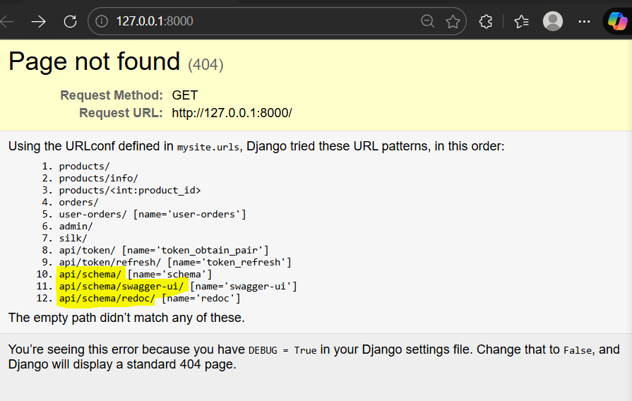
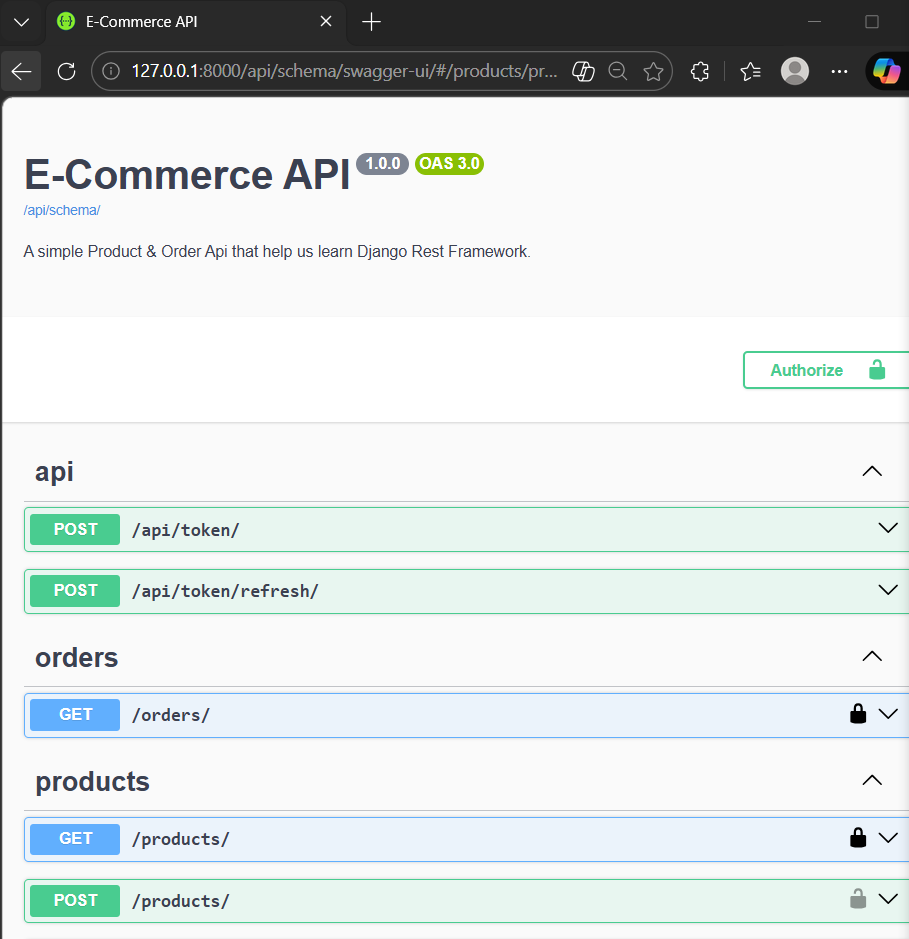
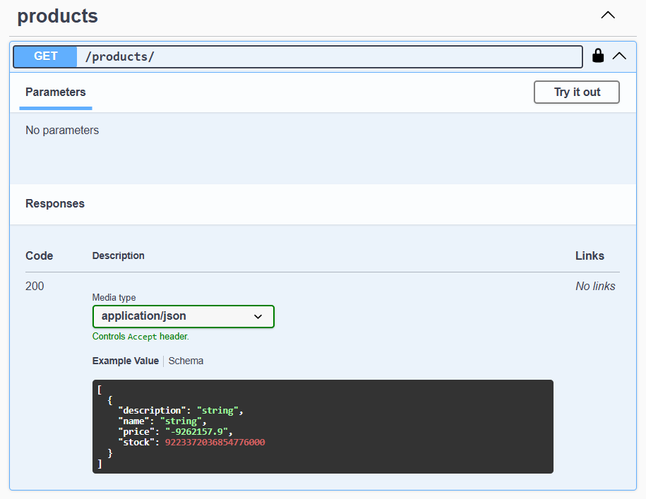
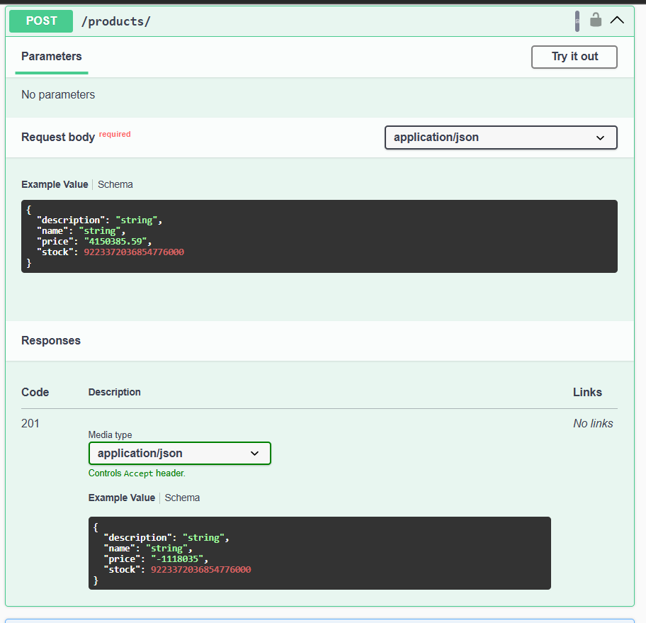
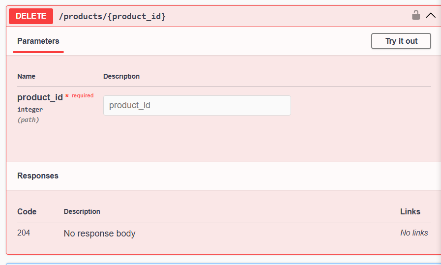
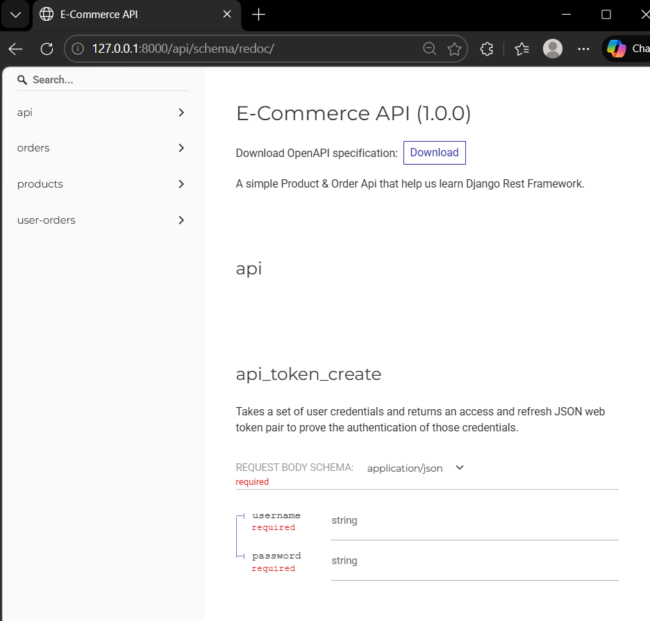

### DRF API Documentation using drf-spectacular

Ref doc: [Documenting API](https://www.django-rest-framework.org/topics/documenting-your-api/)
         [drf-spectacular](https://github.com/tfranzel/drf-spectacular/?tab=readme-ov-file#drf-spectacular)


Step 1: Install drf-spectacular
>> pip install drf-spectacular

Add 'drf-spectacular' to INSTALLED_APPS in `mysite/settings.py`
Also, finally register our spectacular AutoSchema with DRF.
```
REST_FRAMEWORK = { ...,
    'DEFAULT_SCHEMA_CLASS': 'drf_spectacular.openapi.AutoSchema',
}
```

Specify at some metadata:
```
SPECTACULAR_SETTINGS = {
    'TITLE': 'Your Project API',
    'DESCRIPTION': 'Your project description',
    'VERSION': '1.0.0',
    'SERVE_INCLUDE_SCHEMA': False,
    # OTHER SETTINGS
}
```

Step 2: Run a spectacular cmd, this will create schema.yaml file 
>> python ./manage.py spectacular --color --file schema.yml
There are warnings n errors, but created schema.yml file 

Step 3: Add the url pattern in `mysite/urls.py` to serve the schema directly to our api

Run server and open browser to local host, schema urls are added 


Goto url `localhost:8000/api/schema/` will download API.yml file

Goto url `localhost:8000/api/schema/swagger-ui/`


View the GET /products/ shows the response code and description


View the POST /products/ shows both request body and response.


View the DELETE /products/ 


Now, Goto url `localhost:8000/api/schema/redoc/`



