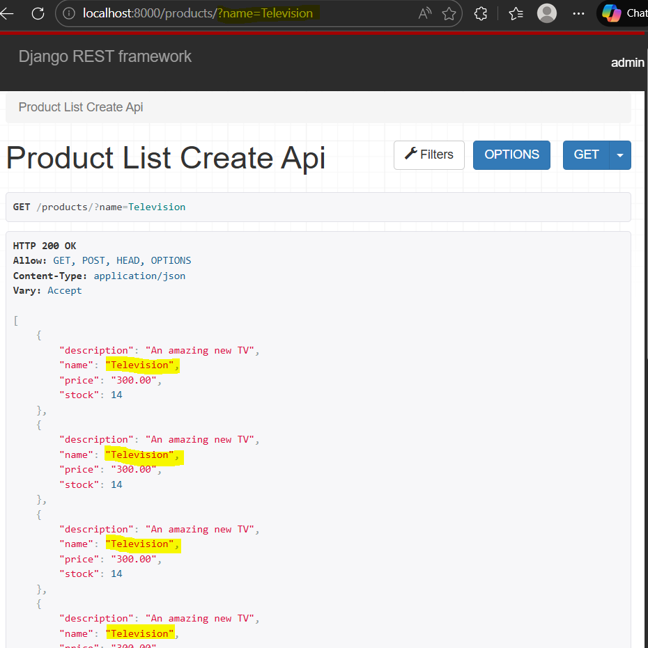
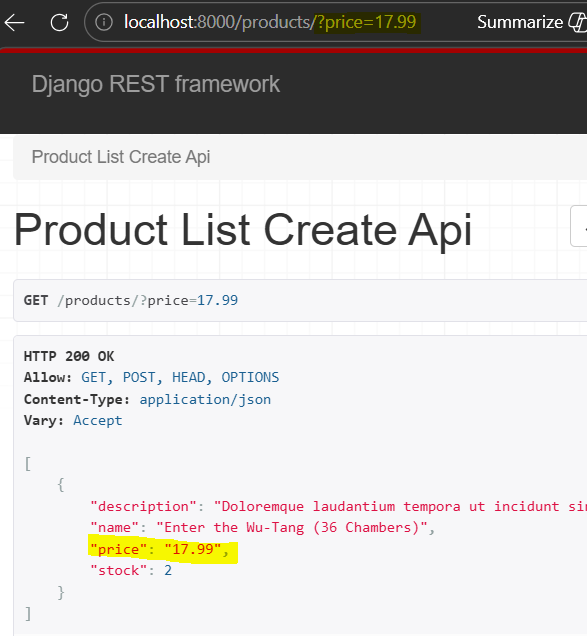
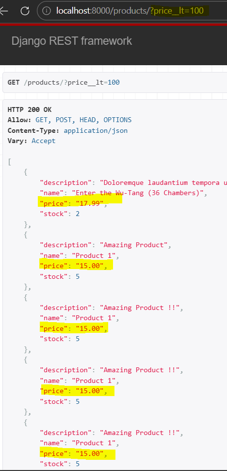
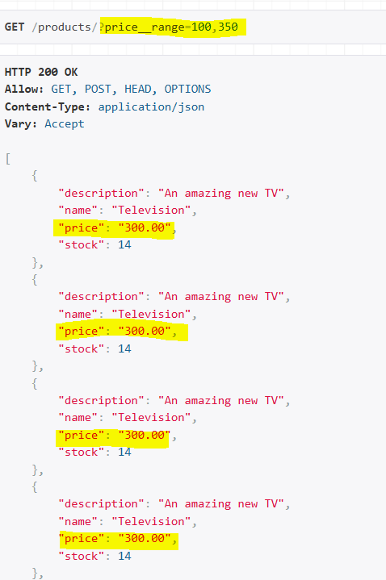
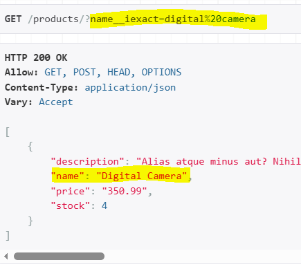

#### DRF API filtering using django-filter

Ref doc: [Filtering](https://www.django-rest-framework.org/api-guide/filtering/) 
[Generic Filtering]()
[DjangoFilterBackend](https://www.django-rest-framework.org/api-guide/filtering/#djangofilterbackend)


Step 1: Install django-filters
>> pip install django-filter

add 'django_filters' to Django's INSTALLED_APPS in `mysite/settings.py`

add the filter backend to settings REST_FRAMEWORK 
``` 'DEFAULT_FILTER_BACKENDS': ['django_filters.rest_framework.DjangoFilterBackend'] ```

Step 2: Add filterset_fileds to `api/views.py/class ProductListCreateAPIView`
filterset_fields = ('name', 'price')

** Run server n test url "http://localhost:8000/products/?name=Television" 


Trying same for price "http://localhost:8000/products/?price=17.99"


This filter will not work for values like price for greater or lower than, also filter is case sensitive
products/?name=digital%20camera return nothing
while, products/?name=Digital%20Camera return one product from DB

Step 3: Create filters.py file within api 
Refer [django-filter doc](https://django-filter.readthedocs.io/en/latest/guide/usage.html#the-filter) and add the code
```
import django_filters
from api.models import Product

class ProductFilter(django_filters.FilterSet):
    class Meta:
        model = Product
        fields = ['name', 'price']
```

In views.py replace filterset_fileds to filterset_class and import filter
`from api.filters import ProductFilter`

To have more options in filter, refer [Declaing filterable](https://django-filter.readthedocs.io/en/stable/ref/filterset.html#declaring-filterable-fields)

Step 4: Change field class to dict
``` 
fields = {
            'name': ['exact', 'contains'], 
            'price': ['exact', 'lt', 'gt', 'range']
        }
```

Now, run server n try few filters for price 
  



Try name filter contain


Step 5: To remove case sensitivity in name field replace dict values to
`'name': ['iexact', 'icontains'],`




