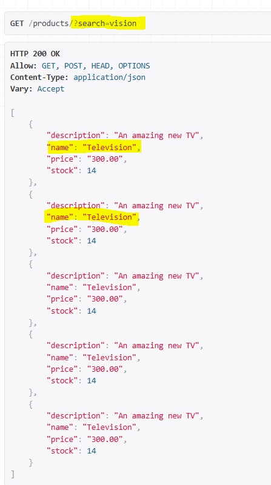
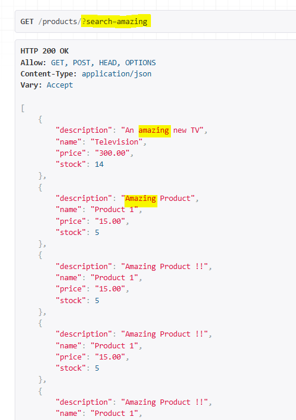
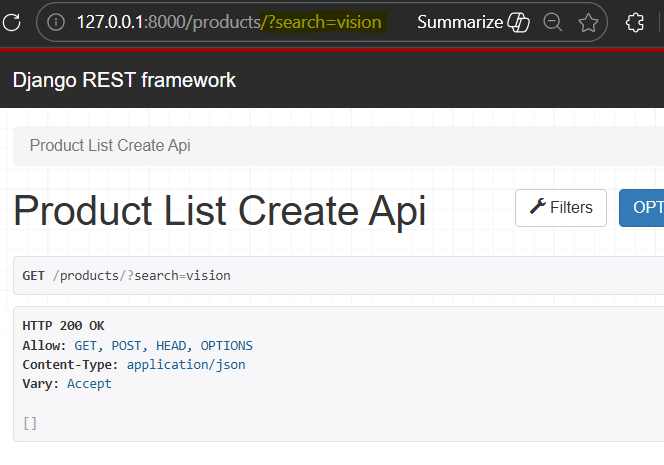
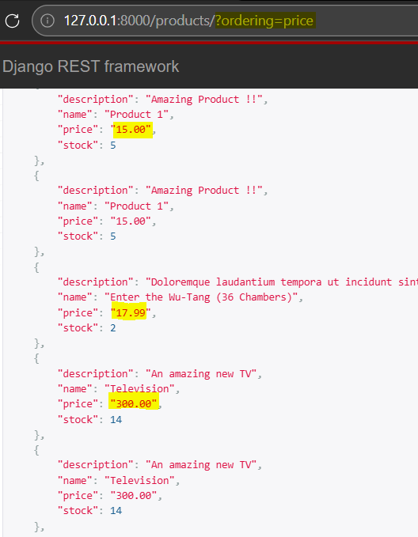
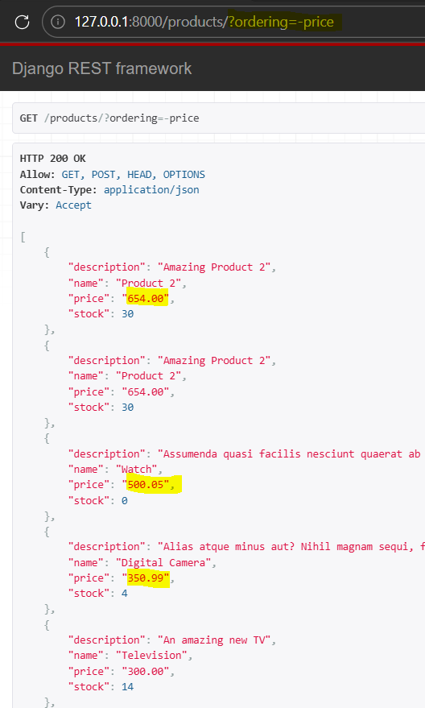

### SearchFilter and OrderingFilter

Reference doc:
[SearchFilter](https://www.django-rest-framework.org/api-guide/filtering/#searchfilter)
[OrderFilter](https://www.django-rest-framework.org/api-guide/filtering/#orderingfilter)

Step 1: In 'api/views/class ProductListCreateAPIView', add following
```
from rest_framework import filters
from django_filters.rest_framework import DjangoFilterBackend

filter_backends = [DjangoFilterBackend, filters.SearchFilter]
search_fields = ['name', 'description']
```

** run server to test browser search
Search pattern in doc is 
`http://example.com/api/<field_name>?search=<pattern>`

`/products/?search=vision` trying to search "vision" in both given fields


Search filter is case insentive, here resulting search for "amazing" in any case


Now, if we want exact match for name field, then we add "=" in searchfields, while description remains contains match 
`search_fields = ['=name', 'description']`

Testing for name=vision returns empty queryset:



Step 2: Add "filters.OrderingFilter" to filterbackends.
Similar to search_fields and ordering_fields
`ordering_fields = ['name', 'price', 'stock']`

** Testing browser: 
for url "/products/?ordering=price", products are displayed in ascending price order


for url "/products/?ordering=-price", products are displayed in descending price order, by adding minus in url


Can try same for name and stock with both asc n desc order
