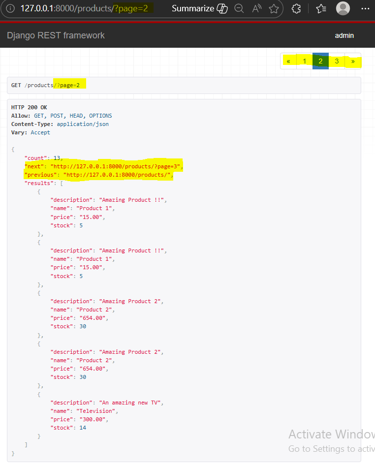
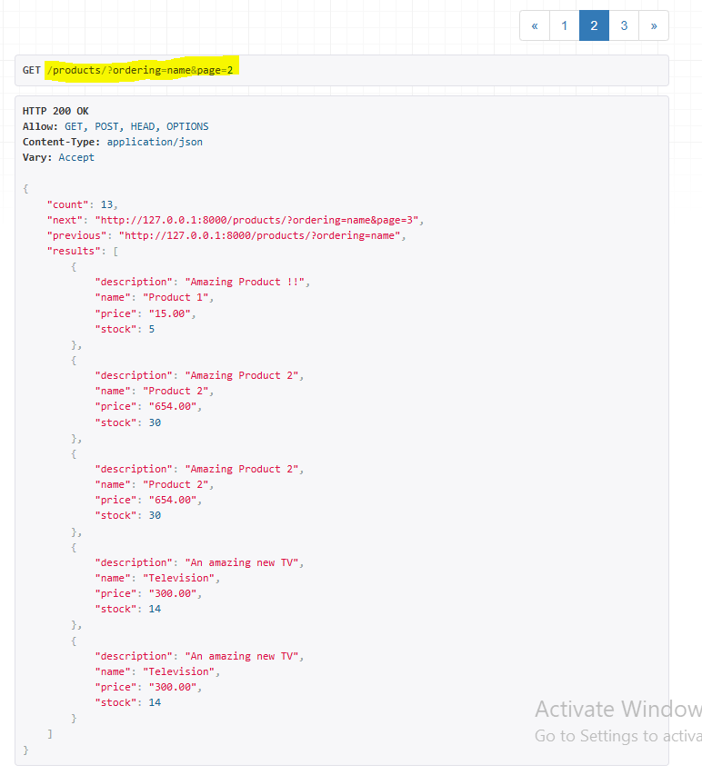
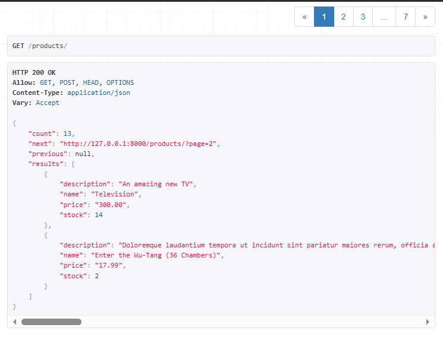
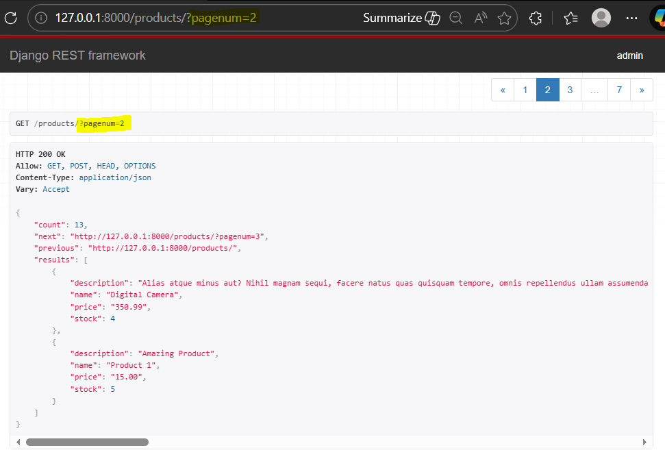
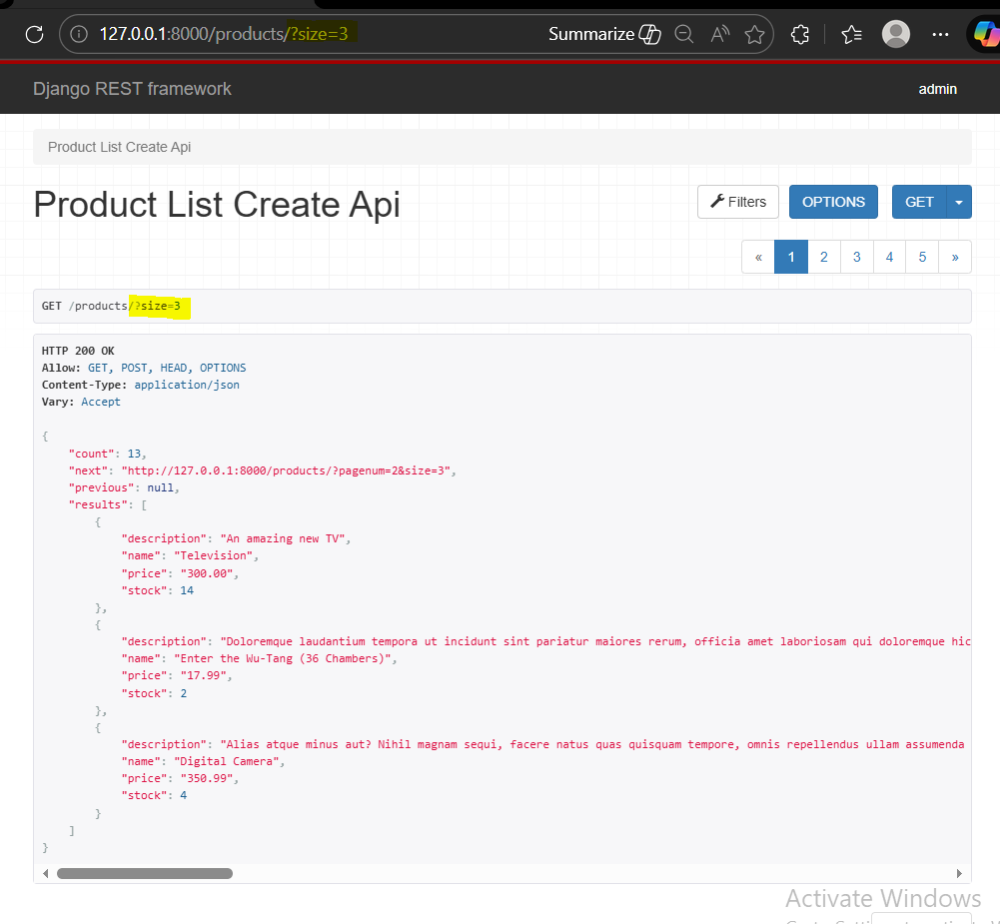
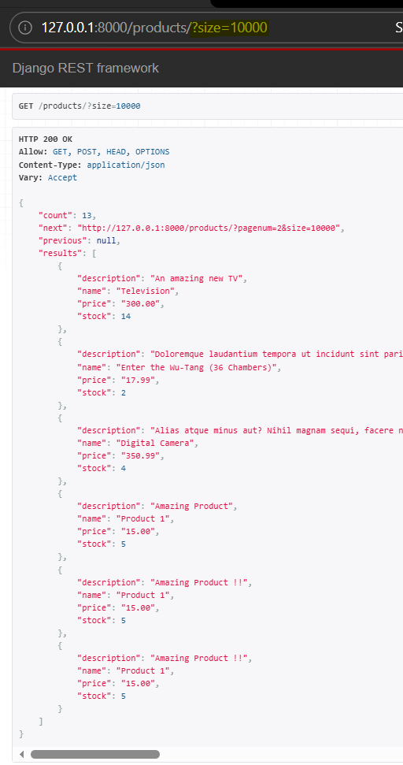
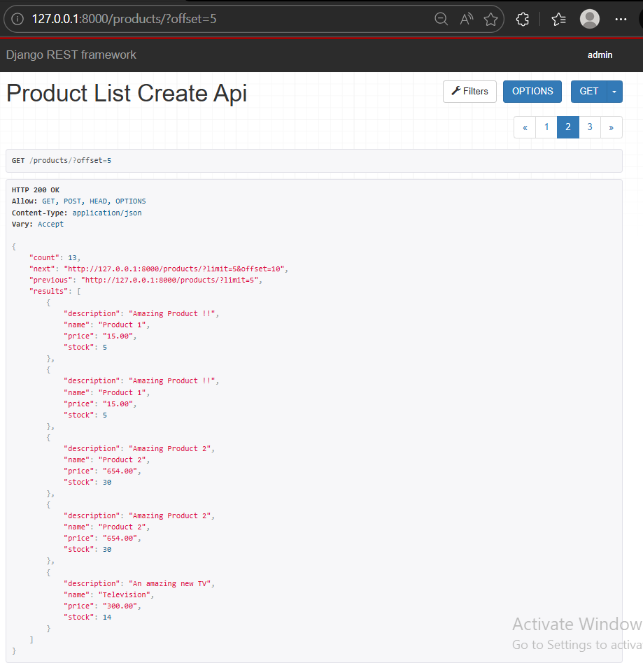
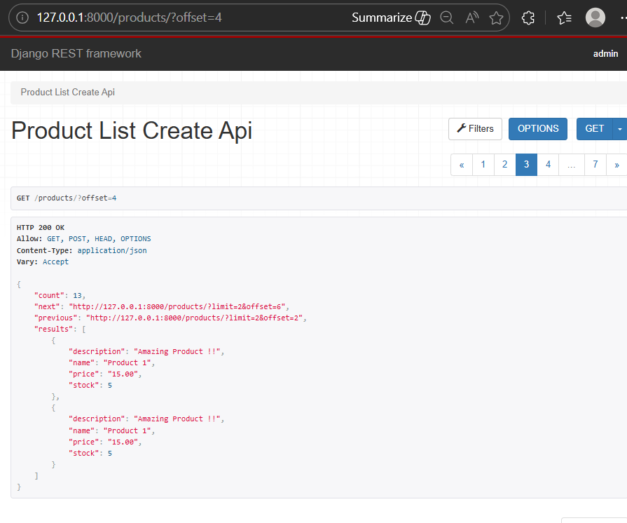
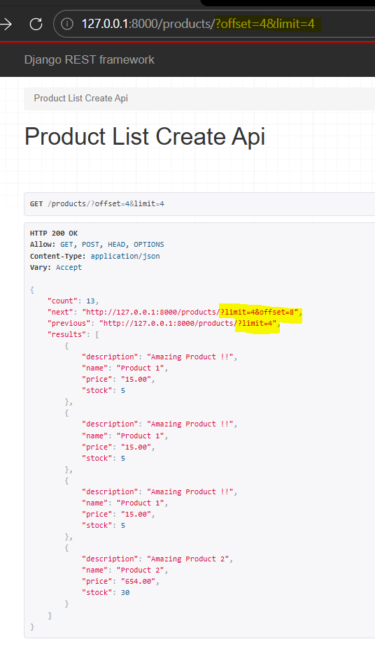

### API Pagination - PageNumberPagination & LimitOffsetPagination

Ref:
[Pagination](https://www.django-rest-framework.org/api-guide/pagination/)
[PageNumberPagination](https://www.django-rest-framework.org/api-guide/pagination/#pagenumberpagination)
[LimitOffsetPagination](https://www.django-rest-framework.org/api-guide/pagination/#limitoffsetpagination)

#### PageNumberPagination
Step 1: For PageNumberPagination, add following setup in settings.py
```
REST_FRAMEWORK = {
    'DEFAULT_PAGINATION_CLASS': 'rest_framework.pagination.PageNumberPagination',
    'PAGE_SIZE': 5
}
```
The above setup allows pagination to all api endpoints that returns list of data.

**Testing: 
Below page has tabs linked to next and previous page. Each page has 5 products or less.
Response includes links to next and previous page. 


Ordering products in ascending



Step 2: Adding the pagination in "views/class ProductListCreateAPIView" and import required pack
`from rest_framework.pagination import PageNumberPagination`
```
pagination_class = PageNumberPagination
pagination_class.page_size = 2
```
** Testing:
Browser reponse has only 2 products each page


* there is a warning with above setup for pagination in terminal:
```UnorderedObjectListWarning: Pagination may yield inconsistent results with an unordered object_list: <class 'api.models.Product'> QuerySet.paginator = self.django_paginator_class(queryset,page_size)```
Replace queryset to `queryset = Product.objects.order_by('pk')`

Step 3: "page" parameter in url can be customized by adding
`pagination_class.page_query_param = 'pagenum'`


This can be done globally for the app as well.

Step 4: Adding `pagination_class.page_size_query_param = 'size'` to above class view to [modify the pagination style](https://www.django-rest-framework.org/api-guide/pagination/#modifying-the-pagination-style)


Step 5: Adding `pagination_class.max_page_size = 6` to above CBV. 
If request page size exceeds the data, `max_page_size` will limit the size as given, here 6. If size below 6, it will return that many.



#### LimitOffsetPagination
Step 1: Import LimitOffsetPagination in viewset
and replace pagination_class to `pagination_class = LimitOffsetPagination` and comment all later parameters. By default the offset is set to PAGE_SIZE set in settings.py


Step 2: Change PAGE_SIZE=2, with next pages offset increments by 2 times, while response return 2 products each page.
Here, page 2 has offset 2 , page 3 has offset 4 and so on.


** Testing:
Adding the limit to offset, limit stays constant while offset increments with each page as above.


In docs, [configuration](https://www.django-rest-framework.org/api-guide/pagination/#configuration_1) has attributes to override the offset with `offset_query_param ` and limit with `limit_query_param ` in different approach by defining them in CBV, similar to above pagination_class attributes.


