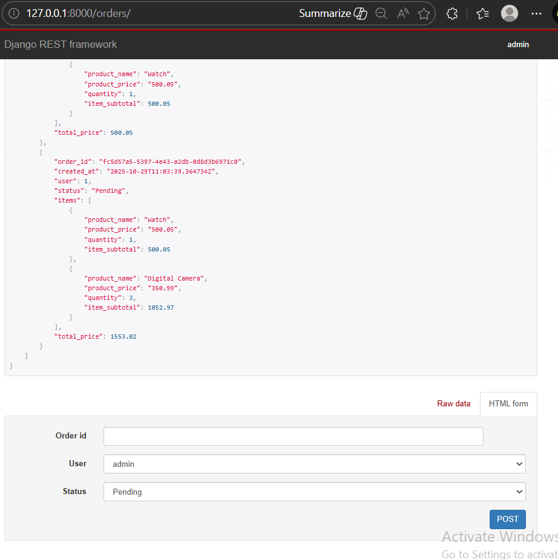
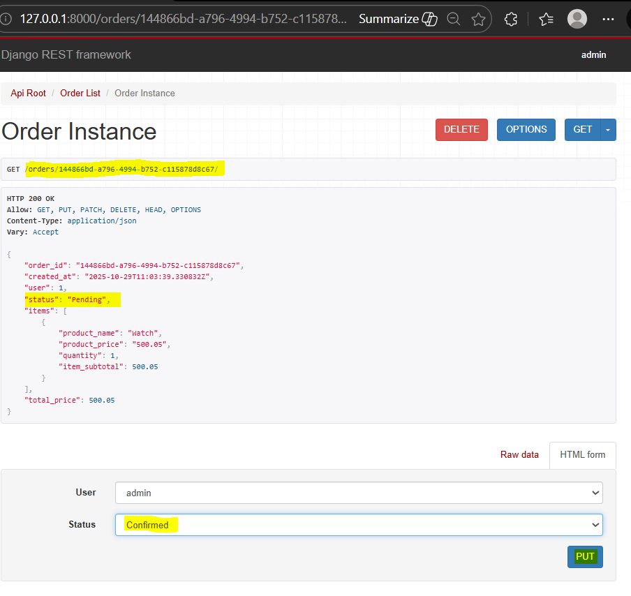

### Viewsets & Routers

Ref Doc:
[Viewsets](https://www.django-rest-framework.org/api-guide/viewsets/)

Step 1: Remove url paths 'orders' and 'user-orders' in "api/urls.py"
Comment out the class OrderListAPIView and UserOrderListAPIView in "api/views.py"

Step 2: Add new class OrderViewSet with same queryset and serializer_class, and add permission_classes to allow any user
```
class OrderViewSet(viewsets.ModelViewSet):
    queryset = Order.objects.prefetch_related('items__product')
    serializer_class = OrderSerializer
    permission_classes = [AllowAny]
```

Step 3: Add Routers in urls.py and import router method after the urlpatterns
```
from rest_framework.routers import DefaultRouter

router = DefaultRouter()
router.register('orders', views.OrderViewSet)
urlpatterns += router.urls 
```

** Testing:
Goto orders/ and view the orders, page also has form to create new order


Step 4: The above page ask for order_id which should be auto-generated. Define field as follows in "api/serializers/class OrderSerializer" 
```order_id = serializers.UUIDField(read_only=True)```

** Verify the Order ID field is removed. Create new order and POST.

Goto any particular order with url "/orders/<order id>" to view order instance. 
Change status to Confirmed.


Refresh page to verify status change.

"orders/" order list shows order with pagination setting, i.e. 2 orders per page 
This can be removed(or customise) by adding below view configuration attributes in "views/ class OrderViewset"
`pagination_class = None`

** Verify the pagination is removed and can view all orders in one page 
