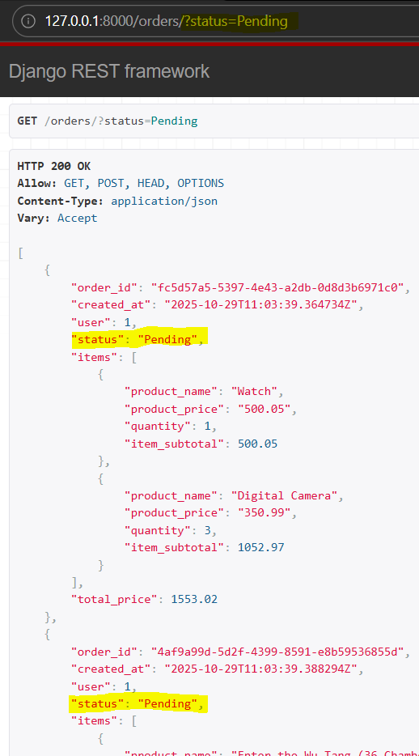
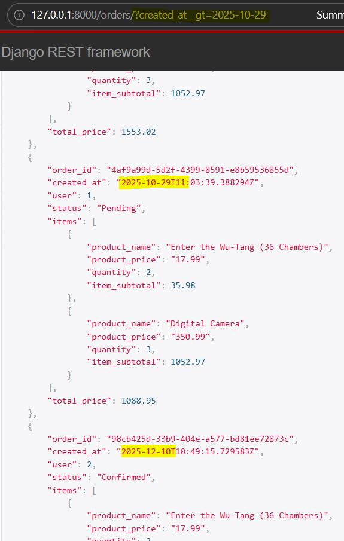
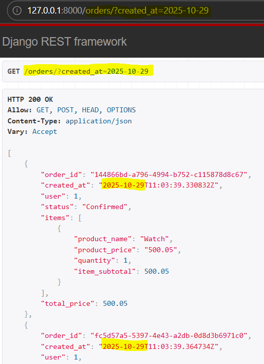
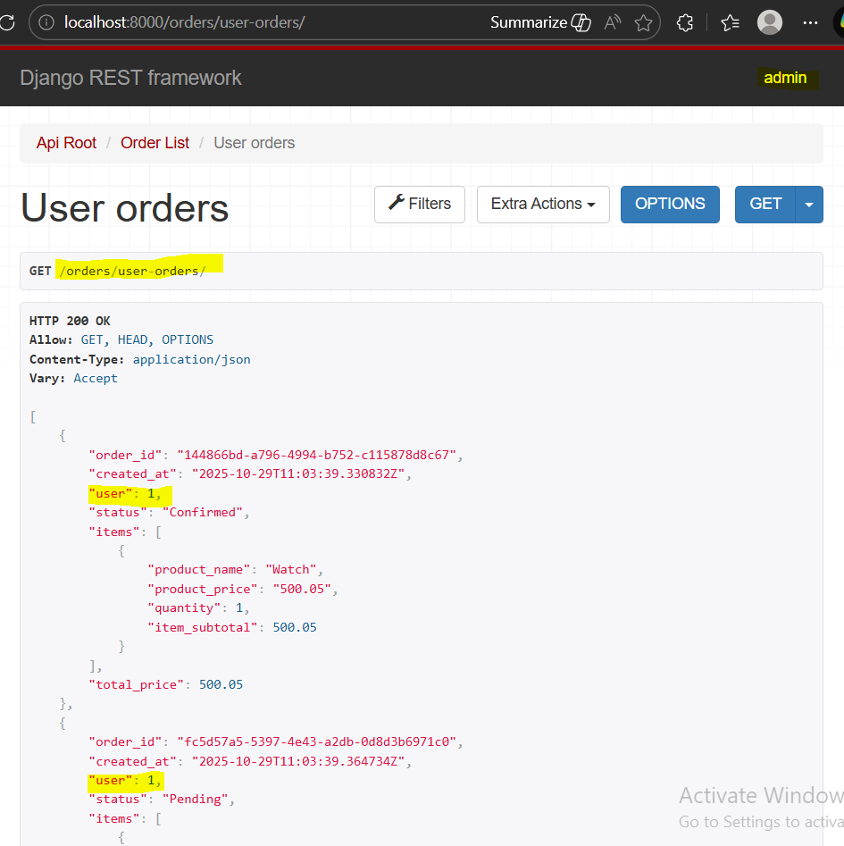
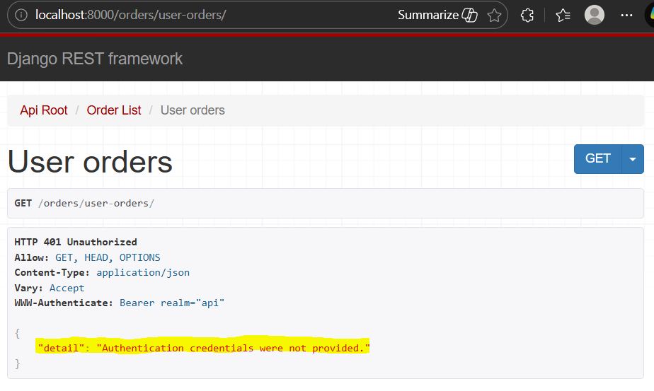
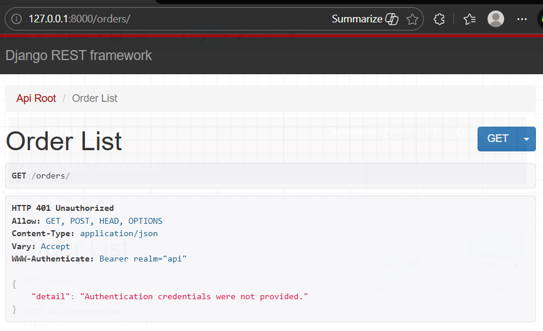

### Viewset Actions, Filtering and Permissions

Step 1: Add class OrderFilter in "api/filters.py"
```
class OrderFilter(django_filters.FilterSet):
    class Meta:
        model = Order
        fields = {
            'status': ['exact'],
            'created_at': ['lt', 'gt', 'exact']
        }
```

Step 2: Import OrderFilter to views.py and add following attributes to class OrderViewSet
```
filterset_class = OrderFilter
filter_backends = [DjangoFilterBackend]
```

Miscellaneous Step: To sort the imports in views.py
>> pip install isort
>> isort .\api\views.py
Fixing C:\Users\Admin\Desktop\python\30 days with vscode\29_Django_Rest_Framework\mysite\api\views.py


** Testing:
Filter orders with status;


Filter orders with created_at;


For exact date filter the response will be empty
Step 3: Add the following field to class OrderFilter
``` created_at = django_filters.DateFilter(field_name='created_at__date') ```


[Extra Actions for routing](https://www.django-rest-framework.org/api-guide/viewsets/#marking-extra-actions-for-routing)

Step 4: Add action decorator followed by user_orders to "views/class OrderViewSet"
```
@action(detail=False, methods=['get'], url_path='user-orders')
    def user_orders(self, request):
        orders = self.get_queryset().filter(user=request.user)
        serializer = self.get_serializer(orders, many=True)
        return Response(serializer.data)
```

** Testing
for user-orders/ url, cannot access as anonymous user, since above orders has filter "request.user"
so login with admin user

This response contains orders that belongs to logged in user, here admin


Step 5: Add `permission_classes=[IsAuthenticated]` to above action decorator


Step 6: Remove permission_classes from @action, and replace permission_classes in OrderViewSet from AllowAny to IsAuthentic
The response of both url "orders/" and "user-orders/" is now Unauthorized.



### 22: Viewset Permissions | Admin vs. Normal User

Aim:
- **Users** can ONLY view their own orders, while **Admins** can view ALL orders.
- **Users** can ONLY update/delete their own orders, while **Admins** can update/delete ALL orders.

Step 1: Add below code to class OrderViewSet
```
def get_queryset(self):
        qs = super().get_queryset()
        if not self.request.user.is_staff:
            qs = qs.filter(user=self.request.user)
        return qs

```

** Testing above code in api.http
Access the below url with both admin and user, which returns orders asociated with user n allow admin to view all orders.
GET http://localhost:8000/orders/ HTTP/1.1
Authorization: Bearer <access token>


** Since, logged with a user, cant access particular order created by another user:
GET http://localhost:8000/orders/144866bd-a796-4994-b752-c115878d8c67 HTTP/1.1
Authorization: Bearer <access token>

>> HTTP/1.1 404 Not Found
{
  "detail": "No Order matches the given query."
}


The custom actions decorator and following function is now redundant, so we removed those lines as we can get user-orders by default as we send request to /orders endpoint.

#####################################

Recap what functionalities ViewSet has provided:
- Full set of urls for all CRUD operations on order model for this django application.
- Serialize data from DB to JSON data and to deserialize incoming request bodies from JSON data to order objects.
- Added permission class, pagination and filters
- Override the few method that customized functionalities and results that are shown to users ,and customise permissions and object access.


