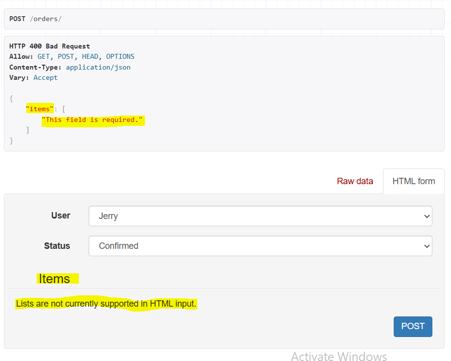
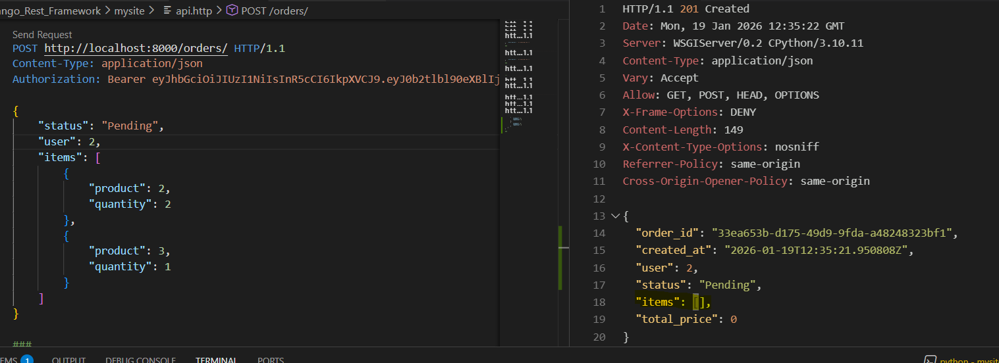
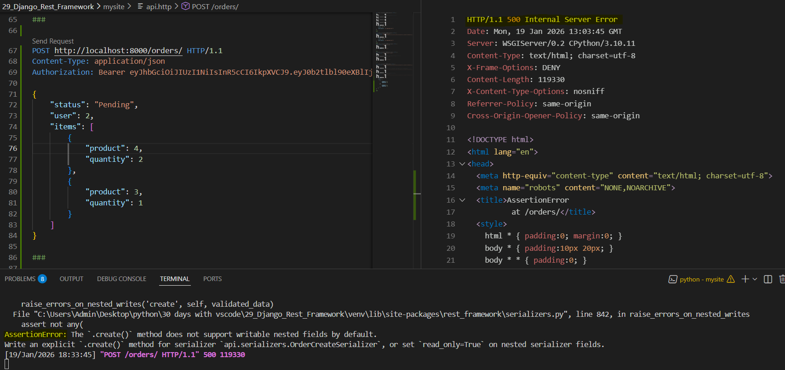
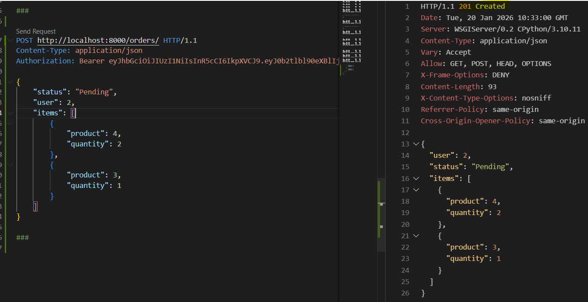
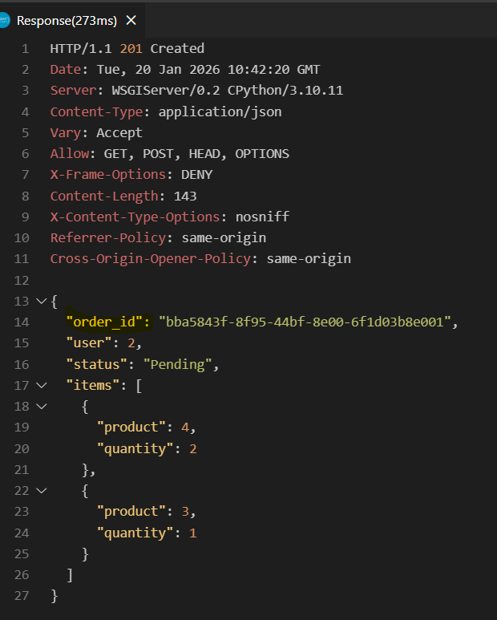
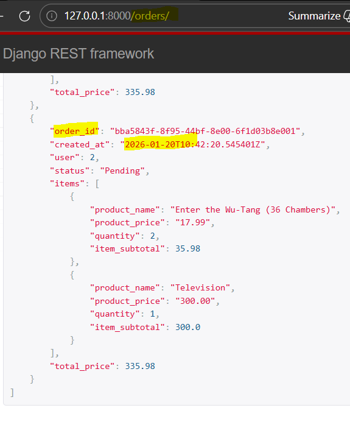
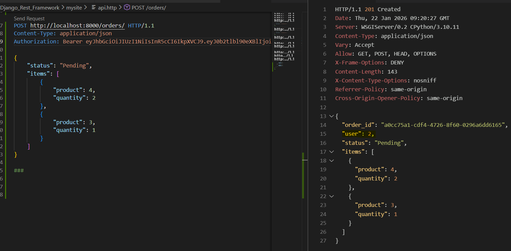

### Creating Nested Objects | Overriding serializer create() method

Ref: [Nested Representations](https://www.django-rest-framework.org/api-guide/serializers/#writable-nested-representations)
  
Currently, "orders/" POST had user and status of the order without creating any items.
Order List simply gets all the orders and its order-items and returns the response, while items are read_only.
Hence POST does not create any item for new order.

Miscellaneous: Remove the "read_only=True" paramenter from "OrderSerializer/items" field.
POST an Order without items will have an error as below


api.http Test:
Created a new order POST with items having product id and quantity fields/keys in POST request, since the OrderItem model has only these 2 values.
The order is created while the items field is blank. Since the OrderSerializer does not know to create an item.


Step 1: Create new OrderCreateSerializer serializer class with nested OrderItemCreateSerializer serializer class:
```
class OrderCreateSerializer(serializers.ModelSerializer):
    class OrderItemCreateSerializer(serializers.ModelSerializer):
        class Meta:
            model = OrderItem
            fields = ('product', 'quantity')

    items = OrderItemCreateSerializer(many=True)

    class Meta:
        model = Order
        fields = (  
            'user', 
            'status',
            'items'
            )
```

Step 2: In "views/class OrderViewSet", we want to have OrderSerializers for request but for POST request we want to call OrderCreateSerializer. Thus, add get_serializer method and import OrderCreateSerializer. If action is POST method or to create, it will return to OrderCreateSerializer:
```
def get_serializer_class(self):
        # can also check if POST method:
        # if self.request.method == 'POST'
        if self.action == "create":
            return OrderCreateSerializer
        return super().get_serializer_class()
```

Step 3: Test the above with api.http POST orders/
It returns an AssetionError that does not support `.create()` method writable in nested fields (here orderitems, i.e. items = OrderItemCreateSerializer(many=True) in above lines, should have read_only=True otherwise)


Step 4: Override the create method in OrderCreateSerializer after items field calling nested class. create an orderitem_data from validated_data and pop the items from the data if any. 
```
def create(self, validated_data):
        orderitem_data = validated_data.pop('items') 
        order = Order.objects.create(**validated_data)

        for item in orderitem_data:
            OrderItem.objects.create(order=order, **item)

        return order
```

** Testing POST in api.http: 


Step 5: Add `order_id = serializers.UUIDField(read_only=True)` and add "order_id" to Meta fields. Test the same 


Also, verify on browser order list endpoint, the above orders are created



Setting user to appear without explicitly adding to POST request, but with authorized user.
Ref: [Passing additional attributes to .save()](https://www.django-rest-framework.org/api-guide/serializers/#passing-additional-attributes-to-save)

Step 1: Save the authenticated user by adding below in views.py/class OrderViewSet. Here we are using [ModelViewSet](https://www.cdrf.co/3.16/rest_framework.viewsets/ModelViewSet.html) perform_create method.
```
def perform_create(self, serializer):
        serializer.save(user=self.request.user)
```

Step 2: There are 2 ways to add authenticated user in serializers.py/class OrderCreateSerializer
a) Mention the user field like order_id and items
`user = serializers.PrimaryKeyRelatedField(read_only=True)`

b) Add user to extra_kwargs(as done here) and set it to read_only under the Meta class
``` 
extra_kwargs = {
            'user': {'read_only': True}
        }
```

** Removed the user from POST request and the above should automatically return the authorizied user 



