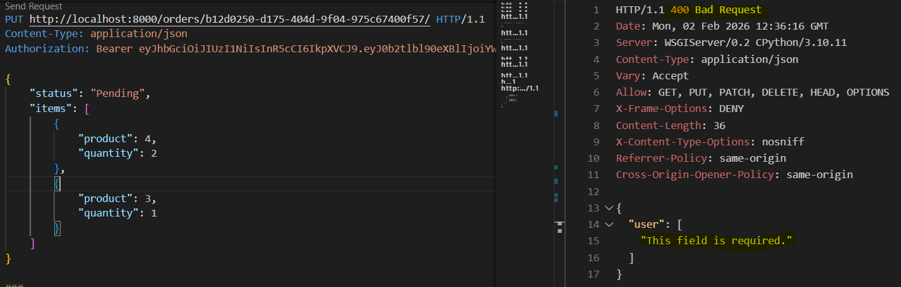
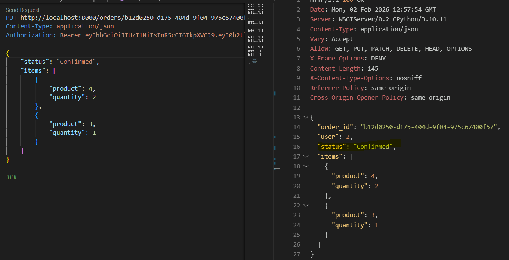
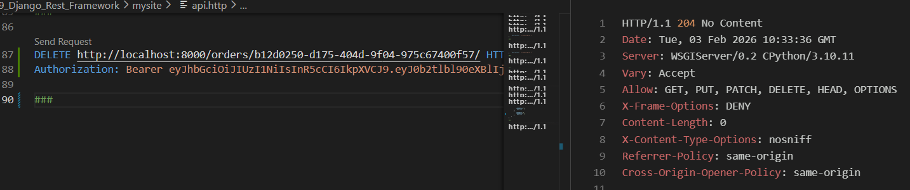
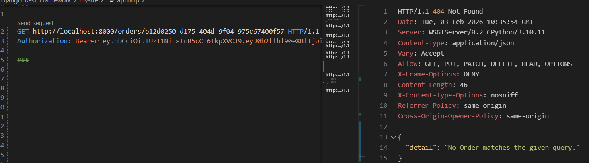

### Updating Nested Objects | ModelSerializer update() method

Ref: [update() method](https://www.django-rest-framework.org/api-guide/serializers/#writing-update-methods-for-nested-representations)


Step 1: Add following to OrderCreateSerializer. 
`instance` here is order that will be updated.
```
def update(self, instance, validated_data):
    pass
```

** Testing in api.http:
PUT request to update an order fails as does not know how to handle the update request at the moment.


Step 2: add action update to OrderViewSet
```
def get_serializer_class(self):
    
    if self.action == "create" or self.action == "update":
        return OrderCreateSerializer
    return super().get_serializer_class()
```

** Testing : PUT request will now throw a server error

Step 3: Here update the items in existing instance/order 
```
def update(self, instance, validated_data):
        orderitem_data = validated_data.pop('items')
        instance = super().update(instance, validated_data)

        if orderitem_data is not None:
            # Clear existing items (optional, depends on requirements)
            instance.items.all().delete()


            # Recreate items with the updated data
            for item in orderitem_data:
                OrderItem.objects.create(order=instance, **item)

            return instance
```

** Testing in api.http:
Changing the status from "Pending" to "Confirmed" to verify the update method


Also, verify the GET request of the same order is updated.

Step 4: If we try send PUT request without items and only update status, it will throw error for items required. 

To keep items update optional, update the items field in OrderCreateSerializer to required=False :
`items = OrderItemCreateSerializer(many=True, required=False)`

So, the items are not impacted but the status is updated as requested, the orderitem_data loop is not touched/evaluated.

Wrap the create() and update() into database transaction
Step 5: We dont want the order to be patially updated. Since we are deleting all items in order instance above and recreating orderitem, we dont want to lose existing order.
Import the following in serializers.py `from django.db import transaction`
For update(), using transaction.atomic() using context manager `with`, tab the code of lines that updates the instance. 

** Testing in api.http: try updating both status and order items verifyng update is error-free

Do the same for create(), wraping the order create into DB transaction 

** Testing to delete the order, send delete request for particular authorized order with authorize token


and try to get the same order 


This works as we have create OrderVieSet with ModelViewSet which provides DELETE action, that knows to destroy object using queryset as provided.


