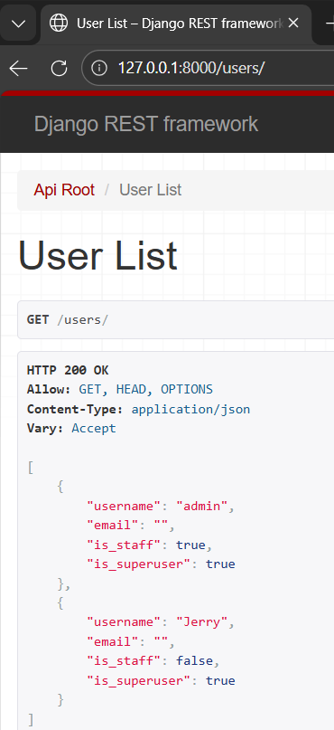
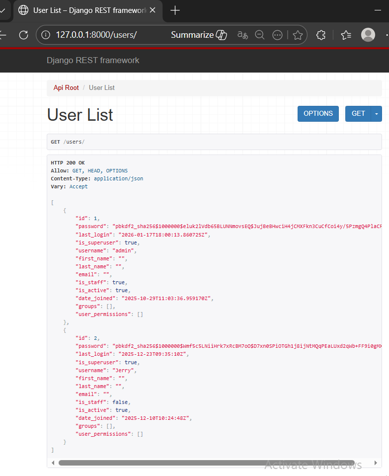
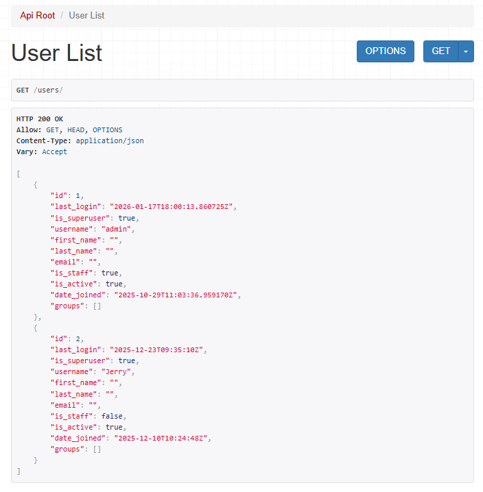
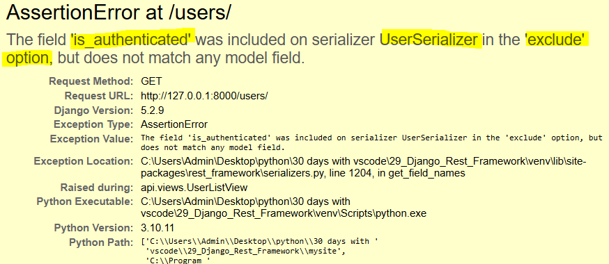
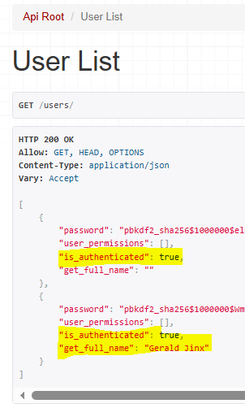
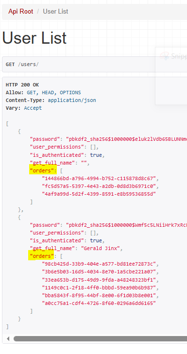

### ModelSerializer Fields - Best Practices

Ref: 

Step 1: Import User model in `serializers.py` and create class UserSerializer
```
class UserSerializer(serializers.ModelSerializer):
    class Meta:
        model = User
        fields = (
            'username',
            'email',
            'is_staff',
            'is_superuser'
        )
```

Step 2: Import User model and serializer to `views.py` and Create List View for User
```
class UserListView(generics.ListAPIView):
    queryset = User.objects.all()
    serializer_class = UserSerializer
    pagination_class = None 
```

Step 3: Create urlpattern in `urls.py`
`path('users/', views.UserListView.as_view()),`

** Testing API endpoint


Step 4: Replace fields in UserSerializer with dunder model '__all__'

** Testing browser endpoint: Now, returns every single field related to User


Its a bad practise since dunder shares hashed password and returning unnecessary data that can impact performance and leak potentially sensitive data

Step 5: Using `exclude` option instead of fields
`exclude = ('password', 'user_permissions')`

** Testing: 


It doesn't work well if unkown fields are mentioned like
`exclude = ('password', 'user_permissions', 'is_authenticated', 'get_full_name')`




But if replaced `exclude` with `fields` again for same fields
`fields = ('password', 'user_permissions', 'is_authenticated', 'get_full_name')`



Add related_name such as order here in models.py/class Order 
`user = models.ForeignKey(User, on_delete=models.CASCADE, related_name='orders')`



