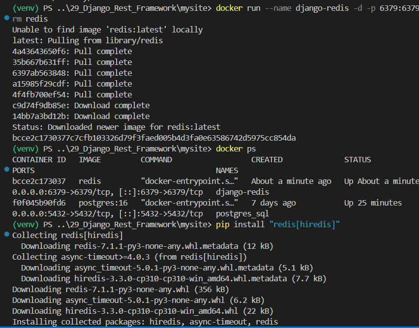
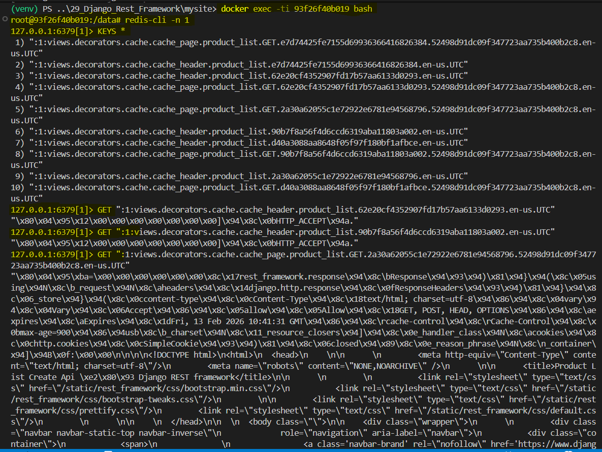

### Caching with Redis and Django

Ref: [DRF Caching](https://www.django-rest-framework.org/api-guide/caching/)
[Redis](https://hub.docker.com/_/redis)
[Django Redis](https://docs.djangoproject.com/en/5.2/topics/cache/#redis)

Step 1: Run following cmds in terminal
>> $ docker run --name django-redis -d -p 6379:6379 --rm redis
>> $ docker ps
>> $ pip install "redis[hiredis]"
>> $ pip install django-redis



Step 2: In "settings.py" add following [django-redis config](https://github.com/jazzband/django-redis?tab=readme-ov-file#configure-as-cache-backend)
```
CACHES = {
    "default": {
        "BACKEND": "django_redis.cache.RedisCache",
        "LOCATION": "redis://127.0.0.1:6379/1",
        "OPTIONS": {
            "CLIENT_CLASS": "django_redis.client.DefaultClient",
        }
    }
}
```

Step 3: In views.py, import following
```
from django.utils.decorators import method_decorator
from django.views.decorators.cache import cache_page
...
class ProductListCreateAPIView(generics.ListCreateAPIView):
... pagination_class ...

@method_decorator(cache_page(60 * 15, key_prefix='product_list'))
def list(self, request, *args, **kwargs):
    return super().list(request, *args, **kwargs)

def get_queryset(self):
    import time
    time.sleep(2)
    return super().get_queryset()

def get_permissions()...
```
** Testing the browser endpoint /product/ is unimpacted

Step 4: Add signals.py file in api/ and ready() method in api/apps.py/class ApiConfig
****** to add context ******

Step 5: Run following in terminal
>> docker ps
*Copy the container id

*open bash using above container id
>> docker exec -ti <container_id> bash
root@<container_id>:/data# redis-cli -n 1   {connects to redis db}
host:port[1]> KEYS *                        {Not recommended cmd in real projects as it blows up redis}

*Copy one of the keys
host:port[1]> GET "<key>"
host:port[1]> ... 
host:port[1]> exit             {returns cache response}
root@<container_id>:/data# exit



Let's try to delete cache_page keys from "KEYS *" cmd result
*Checkout [delete_pattern](https://github.com/jazzband/django-redis?tab=readme-ov-file#scan--delete-keys-in-bulk)

Step 6: Add delete_pattern line in signal.py and run server , open browser endpoint 
Goto django admin/ API -> Products -> click on "Add product" -> fill details -> Save  

Goto /products/ , refresh page and view the product is added
Notice when page is refresh it takes a while since the cache was invalidated when added a new product


