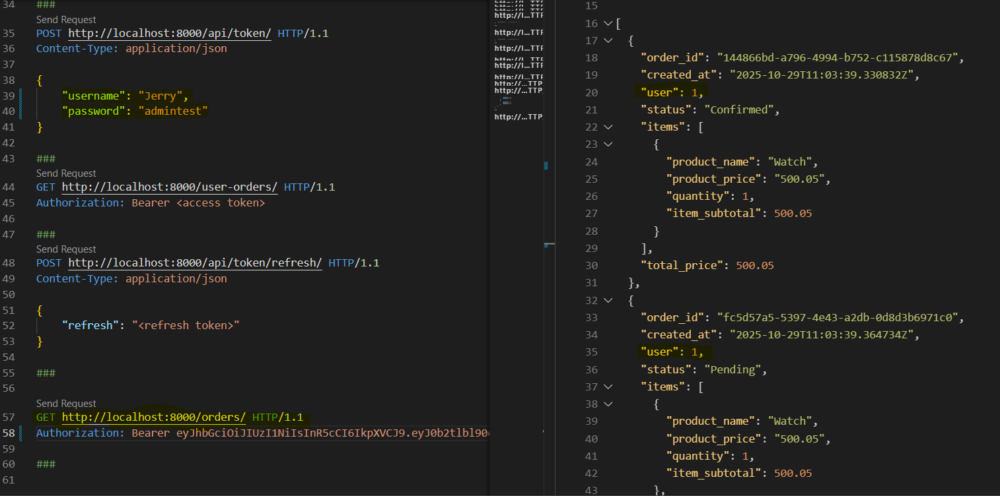
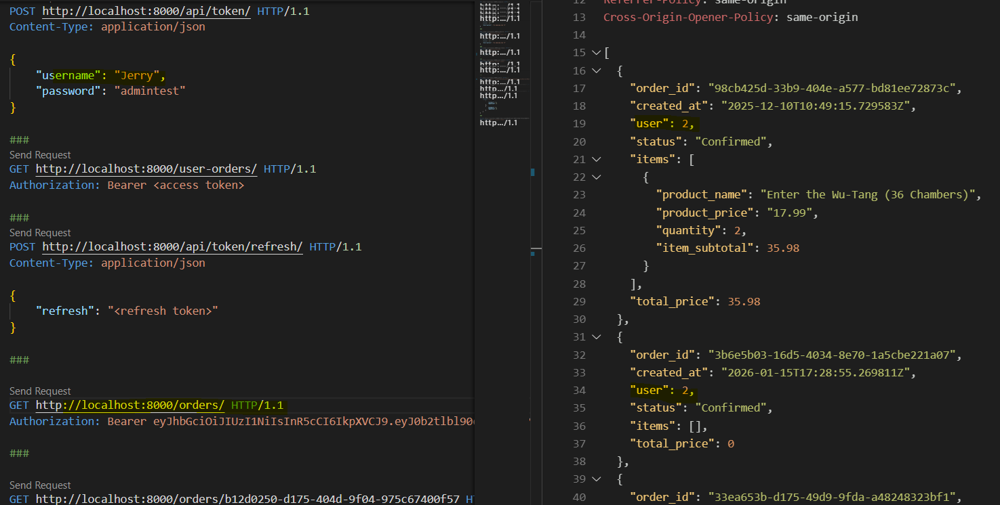

### Django & Redis - Vary Headers to Control Caching Behavior

Ref: [Vary Headers](https://docs.djangoproject.com/en/5.2/topics/http/decorators/#vary-headers)

Step 1: Add the decorator in class OrderViewSet
```
@method_decorator(cache_page(60 * 15, key_prefix='order_list'))
def list(self, request, *args, **kwargs):
    return super().list(request, *args, **kwargs)
```

** Testing in api.http 
- check docker is running 
- Generate access token of user
- Send GET request to orders/ with authorized user
- Now if we change user1 to GET request, notice that response contain information of user2 as it was cached due to use of cache_page decorator in OrderViewSet


The cache decorator will cache for evey DISTINCT url

Step 2: Add below after cache_page decorator 
`@method_decorator(vary_on_headers("Authorization"))`
and 
 `from django.views.decorators.vary import vary_on_cookie, vary_on_headers`


**Before testing, flush the cached data from redis. Run following on terminal
>> docker ps
>> docker exec -ti <container_id> bash
>> redis-cli -n -1
>> KEYS *
>> flushdb

*check if db is empty
>> KEYS *
*exit cli and container

**Testing in api.http
- using user1 send GET request to orders/, this will be cached on redis
- now, change token to user2 and send request, notice the response is user2 unlike before.


Since we used vary_on_headers() with http header "Authorization" , it will cache and vary the response of url based on different user

Step 3: Add SIMPLE_JWT in settings.py
```
SIMPLE_JWT = {
    "ACCESS_TOKEN_LIFETIME": timedelta(minutes=60),
    "REFRESH_TOKEN_LIFETIME": timedelta(days=1),
}
```


