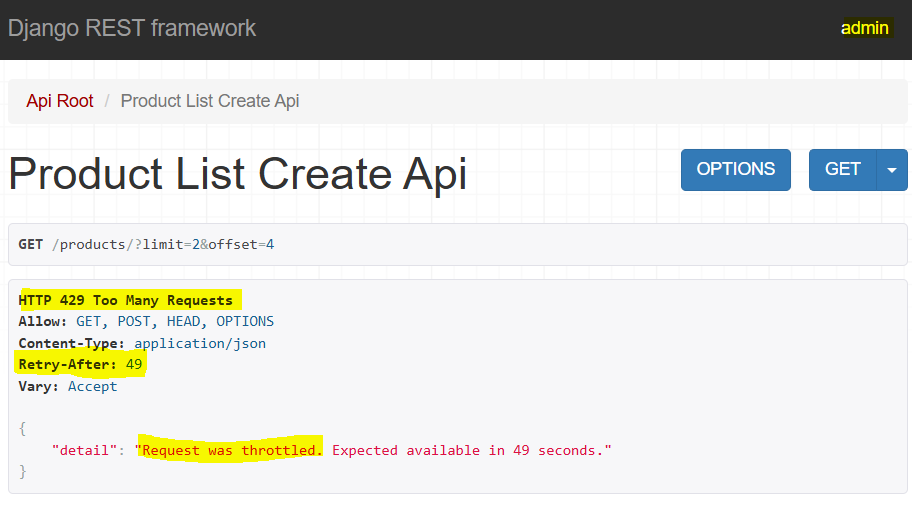
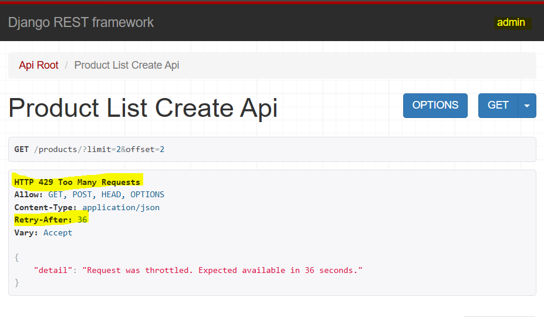
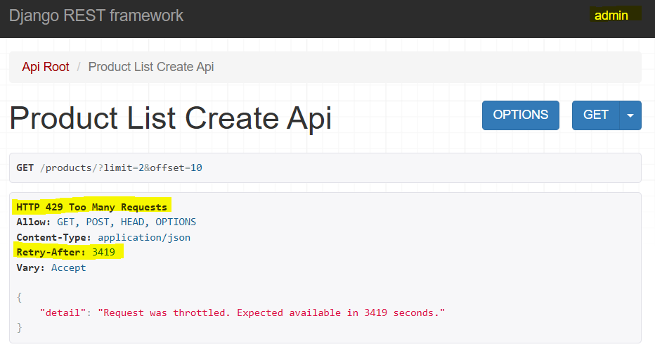
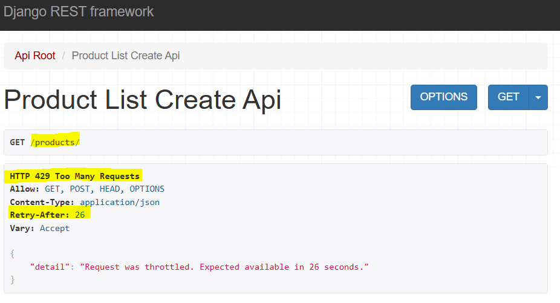
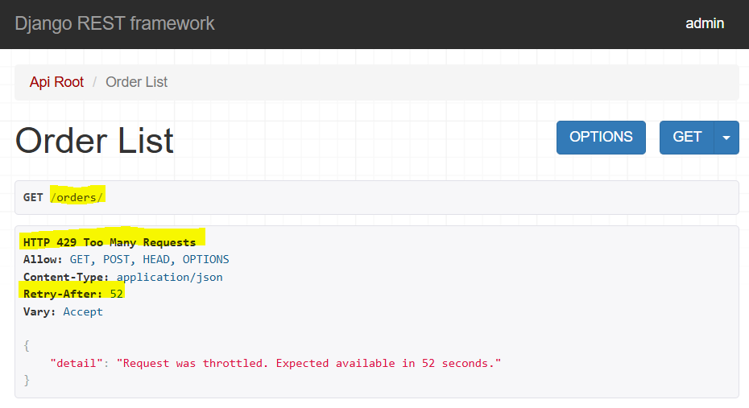
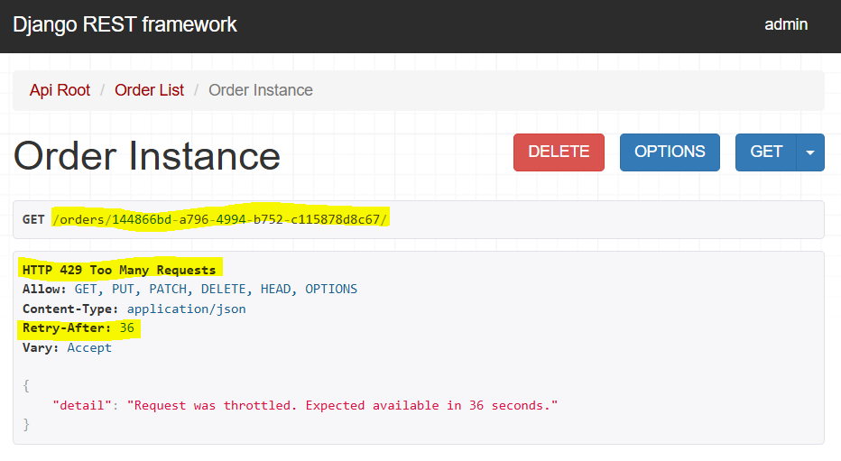

### API Throttling

Ref: [Throttling](https://www.django-rest-framework.org/api-guide/throttling/)

Throttling - is limiting number of API request that can be sent by single user over certain period of time.
for example: if one have free tier website but we  want to allow only 100 request per day or week.

Setting up throttling in our API

Step 1: Add following to settings.py to globally set throttling policy
```
REST_FRAMEWORK = {
    ...
    'DEFAULT_THROTTLE_CLASSES': [
        'rest_framework.throttling.AnonRateThrottle',
    ],
    'DEFAULT_THROTTLE_RATES': {
        'anon': '100/day',
    },
}
```
Here, added only anonymous class with limit to 100 API request call per day. We can also add user and set its limit for authorized user.

**Testing: set `'anon': '2/minute'`, i.e. 2 request per minute.
Open products/ on browser and click next page, that's 2 requests. 
now, if click next page again for 3 request, it will show error as too request and will ask to retry later

[text](28_API_Throttling.md)


For authorized user, lets use [UserRate throttle](https://www.django-rest-framework.org/api-guide/throttling/#userratethrottle)
It uses userID to generate unique key to throttle against.
Step 2: Add the user class and rate set to 3 request per minute
```
'DEFAULT_THROTTLE_CLASSES': [
        ...
        'rest_framework.throttling.UserRateThrottle',
    ],
    'DEFAULT_THROTTLE_RATES': {
        ...
        'user': '3/minute', 
    },
```

**Testing: login using admin and create more than 3 request 


We can create different subclasses of throttle.
For example, user rate throttle allows to create flexible policies.
Here, we want max policy of 10 request/minute and also want users to be able to send 15 request/hour.

Step 3: Create new file in api called "throttles.py"
```
from rest_framework.throttling import UserRateThrottle

class BurstRateThrottle(UserRateThrottle):
    scope = 'burst'

class SustainedRateThrottle(UserRateThrottle):
    scope = 'sustained'
```

and globally setting burst and sustained
```
'DEFAULT_THROTTLE_CLASSES': [
        ...
        'api.throttles.BurstRateThrottle',
        'api.throttles.SustainedRateThrottle'
    ],
    'DEFAULT_THROTTLE_RATES': {
        ...
        'burst': '10/minute',
        'sustained': '15/hour',
    },
```

Here, burst of request represents a short term rapid fire rate limit, which is set to 10 request/minute ( this would be more for different production level application). 
It will provide some protection from being spammed with lots of requests.

Whereas, sustained rate gives more long-term protection. It makes sure that even if someone is not bursting beyound 10 req/min, it still cannot send too many requests to API over longer period of time.

**Testing: Note that logged in as admin and send more than 10 request to verify burst setting.


Now, send 5 more request to verify sustained setting


Notice that after 15 request retry time is more as next request can be sent after an hour due to sustained throttle kicking in.
These 2 throttle work in unison together and that allows to create more flexible policies, to protect against rapid fire requests and to give a sustained rate over greater period of time .
The purpose of these course is to make sure that authenticated clients cannot send too requests over given period of time and that might be important for fair API policy amongst all of clients.


[ScopedRateThrottle](https://www.django-rest-framework.org/api-guide/throttling/#scopedratethrottle) - Restricts access to specific parts of API and throttle will only be applied if the view thats being accessed includes this throttle_scope property.

Step 4: Goto api/views.py/class ProductListCreateAPIView and add 
`throttle_scope = 'products'`
and class OrderViewSet, `throttle_scope = 'orders'`

in settings.py add throttle class `'rest_framework.throttling.ScopedRateThrottle',`and rates for orders and products
```
'products': '2/minute',
'orders': '4/minute',
```

**Testing browser:
Request products/ API more than twice to test throttle


Similarly, verify orders/ API with more than 4 request


This is more flexible because different API endpoints or API views and classes in application can have different scopes and can associate those scopes with different rates.
This is going to work with different endpoints that have same scope.
For example, try orders scope with an orderID and refresh more than 4 times to make it throttled.



Step 5: Remove scoped throttle class from global settings  and in views.py import
`from rest_framework.throttling import ScopedRateThrottle`
and in class ProductListCreateAPIView, define 
`throttle_classes = [ScopedRateThrottle]`

so regardless of what is setup in settings.py, the above view class is going to use whatever is defined as throttle classes and this is how its done on view basis.

To conclude, 3 different throttle classes were implements 
- AnonRateThrottle
- UserRateThrottle
- ScopedRateThrottle

[How clients are identified?](https://www.django-rest-framework.org/api-guide/throttling/#how-clients-are-identified)
- Clients are identified using HTTP headers `X-Forwareded-For` and the `REMOTE_ADDR` WSGI variable are used to uniquely identify client IP addresses for throttling.
- The throttle classes provided by DRF wil use Django's cache backends and for simple setups will use `LocMemCache` or Local Memory Cache.
- This Cache is going to track how many requests a given user has sent and it's going to keep that up-to-date.


NOTE:
"Application-level throttling that DRF provided should not be considered a security measure or protection against brute forcing or denial-of-service attacks."
Throttling is on app-level and does not necessarily prevents these DOS attacks and the reason for that is malicious actors will always be able to spoof IP origins
Using these DRF utilities provides, there are other tools that provide more robust security and its good to have multiple layers of security for any app.
For example, if we want to add things like web app firewalls and can find these on AWS provided tools like AWS Sheild to provide attacks against DOS while Azure has DOS protection service and also cloudflare provides such services.

App-level throtthling provided by DRF is intented for implementing policies such as different business tiers and basic protections against service over-use.


