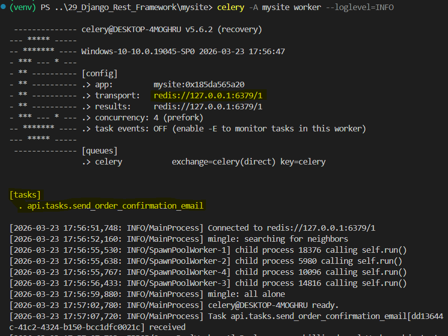

### Celery task with drf

Ref: [Celery docs](https://docs.celeryq.dev/en/main/index.html)
[Celery github](https://github.com/celery/celery)


Step 1: Install Celery 
>> pip install -U Celery

Step 2: Create new file `mysite/celery.py` and paste content from celery docs 
```
import os

from celery import Celery

# Set the default Django settings module for the 'celery' program.
os.environ.setdefault('DJANGO_SETTINGS_MODULE', 'mysite.settings')

app = Celery('mysite')

# Using a string here means the worker doesn't have to serialize
# the configuration object to child processes.
# - namespace='CELERY' means all celery-related configuration keys
#   should have a `CELERY_` prefix.
app.config_from_object('django.conf:settings', namespace='CELERY')

# Load task modules from all registered Django apps.
app.autodiscover_tasks()
```

Step 3: In settings.py add following 
```
# tell celery about Redis - same URL as CACHES setting
CELERY_BROKER_URL = "redis://127.0.0.1:6379/1"

CELERY_RESULT_BACKEND = "redis://127.0.0.1:6379/1"

EMAIL_BACKEND = "django.core.mail.backends.console.EmailBackend"
```

Step 4: In `mysite/__init__.py`
```
from .celery import app as celery_app

__all__ = ('celery_app',)
```

Step 5: Create new file `api/tasks.py`
```
from celery import shared_task
from django.core.mail import send_mail
from django.cong import settings


@shared_task
def send_order_confirmation_email(order_id, user_email):
    subject = "Order Confirmation"
    message = f"Your Order with ID {order_id} has been received and is being processed."
    return send_mail(subject, message, settings.DEFAULT_FROM_EMAIL, [user_email])
```

Step 6: In views.py, import 
`from api.tasks import send_over_confirmation_email`
and
```
class OrderViewSet(viewsets.ModelViewSet):
    ...
    def perform_create(self, serializer):
            order = serializer.save(user=self.request.user)
            send_over_confirmation_email.delay(order.order_id, self.request.user.email)
```

Step 7: Testing by running server
>> docker run --name django-redis -d -p 6379:6379 --rm redis
>> python manage.py runserver

Open new terminal to start celery
>> celery -A mysite worker --loglevel=INFO

** Verify its connected to redis server and tasks are listed out.

** To test the celery task, we need to send email for our example
Step 8: Goto api.http, using exiting POST request for order
```
POST http://localhost:8000/orders/ HTTP/1.1
Content-Type: application/json
Authorization: Bearer <access token>

{
    "status": "Confirmed",
    "items": [
        {
            "product": 4,
            "quantity": 2
        },
        {
            "product": 3,
            "quantity": 2
        }
    ]
}
```

**After sending above request, check celery terminal
It must show TASK sending email, followed by email content printed out.
It will print msg of task with order_id is received and processed.




