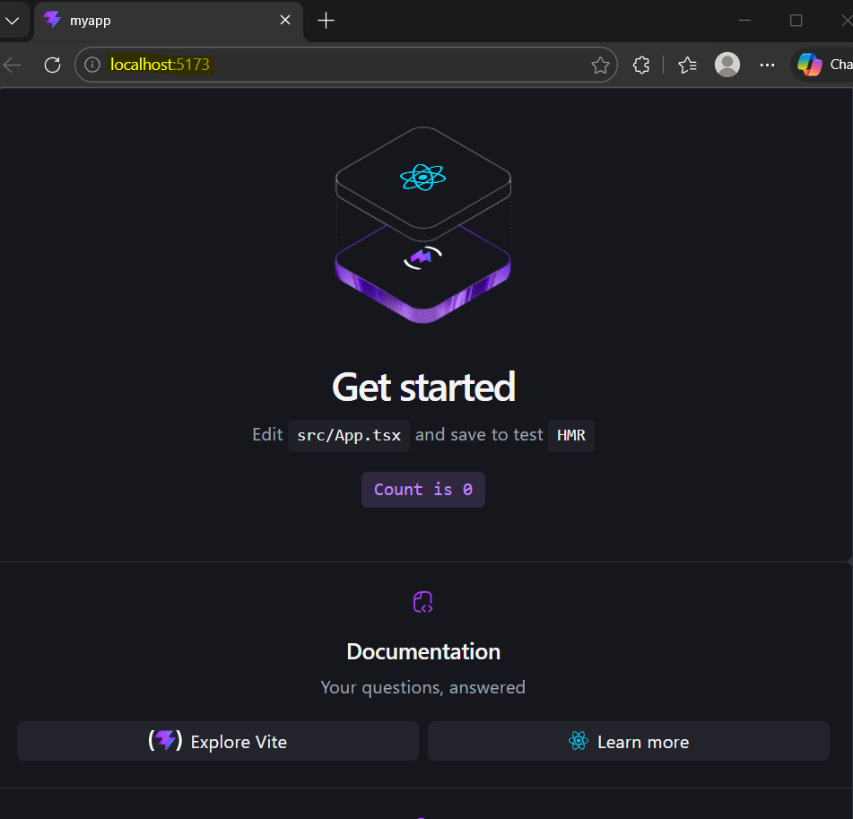

### React with djoser and DRF

Install [node.js](https://nodejs.org/en/download) on PC to run npm cmds.
Finish installation setups with defualt options
restart VSCode or terminal 
run following version cmd to verify installation:
>> node -v
v24.14.1
>> npm -v
11.11.0

Create [React environment](https://react.dev/learn/build-a-react-app-from-scratch#vite) run following cmd in root directory 
>> npm create vite@latest myapp -- --template react

file structure:
29_Django_Rest_Framework/
├── mysite/        (Django backend)
├── myapp/        (React frontend)

After seen this, installation is complete.:
```
VITE v8.0.3  ready in 1651 ms

  ➜  Local:   http://localhost:5173/
  ➜  Network: use --host to expose
  ➜  press h + enter to show help 
```

Open the given link to view React + Vite default page.



